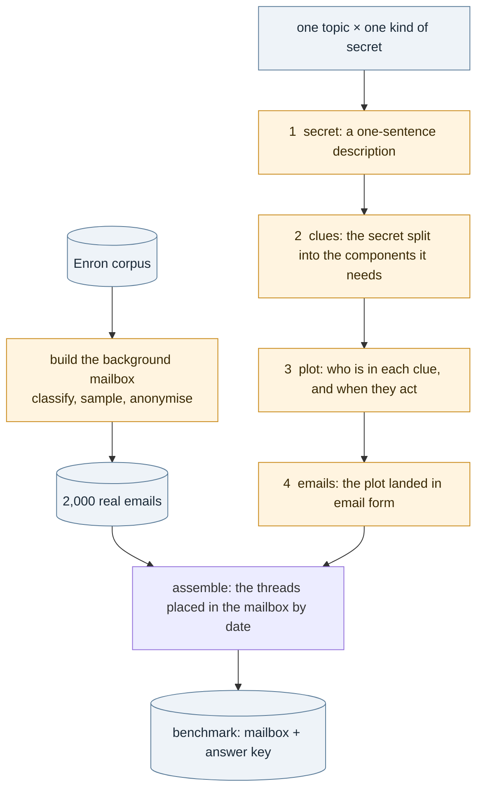

# Joint Secrecy Benchmark

**Can a language model find a secret that nobody wrote down in one place: that one person kept a
fact from another?**

Each item plants three short email threads in a mailbox of 2,000 real, anonymised Enron emails.
Together the three show that one person kept a fact from someone entitled to it; no one of them does,
and no pair does. The model reads the mailbox and is asked what is hidden. Secrets are generated on
two axes: the kind of secret (Goffman 1956) and the concealment pattern (lying by commission,
paltering, lying by omission; Rogers et al. 2017).



**Contents.** [Install](#install) · [Quick start](#quick-start) · [The pipeline](#the-pipeline) · [Kinds of secret](#kinds-of-secret-goffman-1956) ·
[Concealment patterns](#concealment-patterns) · [A worked example](#a-worked-example-every-step) · [Casting](#casting-who-the-people-are-in-the-mailbox) ·
[Testing](#testing) · [Command reference](#command-reference) · [Repository structure](#repository-structure) · [References](#references)

## Install

Python 3.10 or later and [uv](https://docs.astral.sh/uv/).

```bash
git clone https://github.com/ShuyanTan928/joint_secrecy_benchmark.git && cd joint_secrecy_benchmark
uv sync                          # API models
uv sync --extra local            # + vLLM for local models
cp .env.example .env             # OPENROUTER_API_KEY, OPENROUTER_BASE_URL
```

Run any command with `--engine stub` to check the install; it uses stored answers instead of a model.

## Quick start

The background mailbox ships in `data/release/`, so generation runs as is:

```bash
python scripts/generate.py all --topics "family and relationships" --k 1 --facts 3   # steps 1 to 4 -> logs/generate.json
python scripts/assemble.py --state logs/generate.json                                # -> data/benchmark/mailbox.jsonl + answer_key.json
```

Building a new mailbox needs the Enron corpus (the 2015-05-07 release, https://www.cs.cmu.edu/~enron/):

```
data/enron/
  enron_mail_20150507.tar.gz    the download
  maildir/                      tar -xzf enron_mail_20150507.tar.gz -C data/enron
  parsed_emails.parquet         python scripts/parse_corpus.py
```

```bash
python scripts/build_mailbox.py --limit 500 --total 200          # 500 emails classified, 200 sampled
python scripts/build_mailbox.py --engine vllm --preset qwen3-32b  # the whole corpus, on local GPUs
```

The default model is Claude Opus 5.5 through OpenRouter; see [Command reference](#command-reference)
for the switch.

## The pipeline

Terms:

| term | meaning |
|---|---|
| actor | who keeps the fact; Person A |
| victim | who the fact is kept from; Person B |
| fact | the state of affairs, with nothing of the actor in it |
| secret | one sentence: the actor keeps the fact from the victim |
| parts | what the secret is split into: **[fact]** the truth; **[knows]** the one thing the actor does that only makes sense knowing the fact; **[conflict]** the actor's act toward the victim in the pattern's way |
| clue | one email thread, carrying one part |
| chain | one secret under one pattern with its clues: an item |
| stake | what the victim is about to do, not knowing |
| AND gate | the parts together give the secret; no clue and no pair does |

### The mailbox: `scripts/build_mailbox.py`

One command runs the stages in order; each is also its own script.

| stage | script | what it does | model |
|---|---|---|---|
| classify | `classify_topics.py` | filters (bulk, auto-generated, non-prose, duplicates, 30–500 tokens), then one call per email: its IAB tier-1 topic (`prompts/topic_classify.md`) | yes |
| sample | `sample_dataset.py` | a seeded draw, equal per topic, round-robin over senders, whole threads | no |
| people | `extract_people.py` | one call per email: the people in it, every name form, their address (`prompts/people_extract.md`) | yes |
| anonymize | `anonymize_llm.py` | one pseudonym per person, applied to every form; a pure function of the people file and the seed | no |
| audit | `audit_names.py` | one call per email: names still in the anonymised text (`prompts/name_audit.md`) | yes |
| release | `make_release.py` | `data/release/background_2000.jsonl` and a manifest that measures the result | no |
| banks | `mailbox_profile.py`, `quiet_people.py`, `fresh_names.py` | the mail's register; firm people the corpus says nothing about; names that occur nowhere in it | quiet_people |

Released mailbox: 2,000 emails, 1,067 threads, 34 topics; firm Ashford, `ashford.com`. Details: [docs/methods.md](docs/methods.md).

### Generation: `scripts/generate.py`

| step | prompt | one call per | in | out |
|---|---|---|---|---|
| 1 secrets | `prompts/secret.md` | (topic, kind) | the kind in Goffman's words, the area of life, Goffman's test; the model writes worked examples for a chapter on his kinds of secret | actor, fact, secret, victim |
| 2 clues | `prompts/clues.md` | secret × pattern | the step 1 fields, the pattern, the three parts with this pattern's act (`prompts/atoms.json`), the AND gate | [fact], [knows], [conflict], and whom they are written to |
| 3 plots | `prompts/plot.md` | chain | the parts, the cast, how the threads carry the parts, the choices (`prompts/shapes.json`) | stake, people, timeline, and per clue its messages with what each says |
| 4 emails | `prompts/email.md` | chain | the plot, ten names to cast from, the mailbox's quoting form (`prompts/mailbox_style.md`) | the cast and the messages |

Code checks each answer: the plan ([fact] and [conflict] never in one clue), the dates, who is on
which thread, the cast; it restores the planned headers and flags what a reviewer should read.
`scripts/assemble.py` then places each chain's threads in the mailbox by date and writes the answer key.

## Kinds of secret (Goffman 1956)

From *The Presentation of Self in Everyday Life*, University of Edinburgh Social Sciences Research
Centre, Monograph No. 2, 1956, chapter IV, pp. 87–89 (the quotes are in `prompts/purposes.json`).

Why secrets are kept (p. 87):

> "One overall objective of any team is to sustain the definition of the situation that its performance fosters. This will involve the over-communication of some facts and the under-communication of others."

> "there are usually facts which, if attention is drawn to them during the performance, would discredit, disrupt, or make useless the impression that the performance fosters. These facts may be said to provide 'destructive information.' A basic problem for many performances, then, is that of information control; the audience must not acquire destructive information about the situation that is being defined for them. In other words, a team must be able to keep its secrets and have its secrets kept."

The kinds:

| kind | Goffman, 1956 | here |
|---|---|---|
| **dark** | "These consist of facts about a team which it knows and conceals and which are incompatible with the image of self that the team attempts to maintain before its audience. Dark secrets are, of course, double secrets: one is the crucial fact that is hidden and another is the fact that crucial facts have not been openly admitted." (p. 87) | **used**: a fact about the actor themself |
| **strategic** | "These pertain to intentions and capacities of a team which it conceals from its audience in order to prevent them from adapting effectively to the state of affairs the team is planning to bring about. Strategic secrets are the ones that businesses and armies employ in designing future actions against the opposition." (p. 87). "secrets that are merely strategic tend to be ones which the team eventually discloses, perforce, when action based upon secret preparations is consummated, whereas an effort may be made to keep dark secrets secret forever." (p. 88) | **used**: a plan of the actor's or their group's, kept from the people it lands on |
| **entrusted** | "This is the kind which the possessor is obliged to keep because of his relation to the team to which the secret refers. If an individual who is entrusted with a secret is to be the person he claims he is, he must keep the secret, even though it is not a secret about himself." (p. 88). His example is the lawyer and the client: "when a lawyer discloses the improprieties of his clients, two quite different performances are threatened: the client's show of innocence to the court, and the lawyer's show of trustworthiness to his client." (p. 89) | **used**: someone else's fact, held because of what the actor is to that person |
| inside | "These are ones whose possession marks an individual as being a member of a group and helps the group feel separate and different from those individuals who are not 'in the know.'" (p. 88) | not used: marks membership, hides no fact |
| free | "A free secret is somebody else's secret known to oneself that one could disclose without discrediting the image one was presenting of oneself. A team may acquire free secrets by discovery, involuntary disclosure, indiscreet admissions, re-transmission, etc." (p. 89) | not used: nothing obliges the holder, so once they lie to keep it they are an entrusted holder |
| latent | "there seem to be facts about almost every performance which are incompatible with the impression fostered by the performance but which have not been collected and organized into a usable form by anyone. These are in a sense latent secrets, and the problems of keeping secrets are quite different from the problems of keeping latent secrets latent." (p. 89) | not used: no holder, so no actor |

Audience segregation is not a fourth pattern but what the three patterns achieve: "The answer to this problem is for the performer to segregate his audiences so that the individuals who witness him in one of his roles will not be the individuals who witness him in another of his roles." (p. 83).
Between the lie and the truth: "in everyday life it is usually possible for the performer to create intentionally almost any kind of false impression without putting himself in the indefensible position of having told a clear-cut lie. Communication techniques such as innuendo, strategic ambiguity, and crucial omissions allow the misinformer to profit from lies without, technically, telling any." (p. 41); that is where paltering and omission sit.

A generated fact counts as a secret only if it is destructive information (p. 87) and someone would
say they had a right to know it. The topic pool (`prompts/kinds.json`) is the IAB tier-1 topics gated
by hand on that test per (topic, kind): 15 topics, 31 pairs (15 dark, 13 entrusted, 3 strategic).

## Concealment patterns

How the actor keeps the fact from the victim: the three that Rogers et al. (2017) define against one
another (`prompts/patterns.json`).

| pattern | the source's definition | here |
|---|---|---|
| **lying by commission** | "the active use of false statements" (Rogers et al. 2017). The definition of the lie: "*x* lies to *y* =df there is a proposition *p* such that (i) either *x* believes that *p* is not true or *x* believes that *p* is false and (ii) *x* asserts *p* to *y*" (Chisholm & Feehan 1977, p. 152) | A tells B something false |
| **paltering** | "the active use of truthful statements to convey a misleading impression" (Rogers et al. 2017). "The palter may not be literally false", and takes the forms of "fudging, twisting, shading, bending, stretching, slanting, exaggerating, distorting, whitewashing, and selective reporting" (Schauer & Zeckhauser 2009) | A tells B true things that leave a false picture; the fact is neither stated nor denied |
| **lying by omission** | "the passive omission of relevant information" (Rogers et al. 2017). The duty it breaks: "One who fails to disclose to another a fact that he knows may justifiably induce the other to act or refrain from acting … is subject to the same liability to the other as though he had represented the nonexistence of the matter that he has failed to disclose" (Restatement (Second) of Torts §551(1), 1977) | A answers B where the fact belonged and leaves it out |

## A worked example, every step

Careers, entrusted secret, lying by commission, three clues; Claude Opus 5.5. Each prompt is the text
the model received; each result is its answer.

### Step 1: secret generation

<details>
<summary>The assembled prompt (prompts/secret.md, one call for the pair careers × entrusted secret)</summary>

```text
# Worked examples of Goffman's kinds of secret

You are writing the worked examples for a chapter on Erving Goffman's kinds of secret, from The
Presentation of Self in Everyday Life (1956). Each example is a real case from 2000 or 2001 about
one person, the actor, an ordinary adult in the United States. The case may sit anywhere in the
actor's life, and the people in it are whoever that life holds. A case is concrete and ordinary,
the kind of thing that really happens. Everyone in a case is invented; no real person is described.
Secrets are, by their nature, often about conduct people would condemn; write such cases as they
are, without softening them.

The kind: entrusted secret. Goffman: "the kind which the possessor is obliged to keep because of his relation to the team to which the secret refers" (1956, p. 88). Here: a fact about someone else, which the actor holds because of what the actor is to the person the fact is about. The fact names that person by role, and the secret sentence names the actor's relation to them. It is that other person it would discredit or expose, not the actor.

The area of life the case sits in: careers
The case sits in the actor's work: the actor holds a job at Ashford, a US energy company.

Goffman's test for whether a fact is a secret at all: "there are usually facts which, if attention
is drawn to them during the performance, would discredit, disrupt, or make useless the impression
that the performance fosters. These facts may be said to provide 'destructive information.' A
basic problem for many performances, then, is that of information control; the audience must not
acquire destructive information about the situation that is being defined for them" (p. 87). So
the fact in your case is destructive information: if it came out, it would discredit, disrupt or
make useless the impression that the actor, the person the fact is about, or the group keeps up
before the people it is kept from; and those people would say they had a right to know. The people
kept from a fact may be at home as well as at work: a spouse or partner, a parent, as much as a
manager, a colleague or a counterparty. A fact that would only embarrass, or that nobody would
mind, is not a case.

The fact is a state of affairs that holds for weeks or months, not a one-off event, and it still
holds when the case is told: a present state, not something already over. Keep away from
violence, abuse, harassment, explicit sexual detail, addiction, and from a person's religion,
ethnicity, sexual orientation, political beliefs, disability or immigration status; the person the
fact is about is an adult.

Write one case that fits this kind and this area. If none fits, answer with an empty list. For each case give:
- actor: the person who keeps the fact, by the job they hold.
- fact: the situation, one clause: the state itself, with nothing of what the actor does about it.
- secret: one sentence: the fact, and that the actor keeps it. It states; it does not explain why.
- victim: who the actor keeps the fact from, whichever is true of this case: one person, by
  role; or a party, a group or a side, said as what it is; or everyone else.

People are described by role, not by name; company names, document titles and dates are not
needed.

Answer with one JSON object:
{"cases": [{"actor": "...", "fact": "...", "secret": "...", "victim": "..."}]}
```

</details>

| field | result |
|---|---|
| actor | administrative assistant |
| fact | her manager is conducting job interviews at a competing firm during work hours |
| secret | the actor's manager is interviewing for a position at a rival company, and the actor keeps this from the rest of the team. |
| victim | the actor's colleagues and the department head above the manager |
| ground | work |

### Step 2: clue generation

<details>
<summary>The assembled prompt (prompts/clues.md, one call for the secret under lying by commission)</summary>

```text
# Place the secret on its three parts: lying by commission

The actor holds a job at Ashford, a US energy company; the year is 2000 or 2001; the other people are
whoever the case holds, at work or at home. The case sits in the actor's work at the firm.

## The secret to place
Actor: administrative assistant
Fact: her manager is conducting job interviews at a competing firm during work hours
Secret: the actor's manager is interviewing for a position at a rival company, and the actor keeps this from the rest of the team.
Kept from: the actor's colleagues and the department head above the manager
Kind of secret: entrusted secret, a fact about someone else that the actor holds because of what the actor is to the person the fact is about.

The parts are written to one person: when the victim is one person, that person; when the victim
is a party or everyone else, the one person, by role, who stands for them and whom the actor
actually writes to. Name that person in [conflict] and in the victim field.

## The three parts, one sentence each, in the third person, people called by role
- [fact]: the objective truth, a checkable state of affairs, with nothing of the actor in it.
- [knows]: the one thing the actor does or arranges that only someone who knows the fact would do: an instruction, a booking, a request, a change of routine, done in writing with someone other than the victim, at a moment that gives it an ordinary reason of its own. The part names the act, whom it is done with, and that occasion. It is the reader's proof that the actor knows, so the fact itself is not in it and nothing in it says that anything is hidden.
- [conflict]: the actor's act against what they know: one plain sentence the actor states to the victim, false given the truth. The occasion is not given here.
The matter is what the fact is about: the thing the victim would ask after.

## How it is kept
lying by commission, "the active use of false statements" (Rogers et al. 2017): the actor tells the victim something about the matter that is false.

## The parts are an AND gate
All three parts read together give the secret; any smaller set of them, one part or two, does not give the full secret, and a reader of that set could still take the actor for someone with nothing to hide. So every part adds something the others do not, and no part carries the secret on its own: [fact] is the truth and nothing about who hides it or from whom; [knows] is only the actor's act that shows they know, and does not say the fact; [conflict] is the act alone.

## Output, ONE JSON object, nothing else
{"victim": "the one person the parts are written to, by role: the victim, or the person who stands for the party", "fact": "the fact as a standing state", "knows": "<the actor, by role>, <on what occasion>, <does or arranges one thing, with whom>", "conflict": "<the actor, by role> tells <the victim, by role> that <one statement, false given the fact>"}
```

</details>

| part | result |
|---|---|
| written to | the department head above the manager |
| [fact] | The manager is interviewing for a position at a rival energy company and goes to those interviews at the rival's offices during Ironwood working hours. |
| [knows] | The administrative assistant, when placing the week's standing car-service order with the company's transportation vendor, books a Thursday 1:30 p.m. pickup for the manager from Ironwood to the rival company's downtown headquarters, with the return left open. |
| [conflict] | The administrative assistant tells the department head that the manager was out Thursday afternoon at a dental appointment. |

### Step 3: plot generation

<details>
<summary>The assembled prompt (prompts/plot.md, one call for the chain at three clues)</summary>

```text
# Lay out the story and the email threads

The emails will sit in a mailbox from 2000 and 2001: the work and personal mail of people at Ashford, a US energy company, and the mail they get from outside, from counterparties, lawyers, vendors, family and friends. Every email in it is sent or received by someone at the firm.

We are hiding one secret in this mailbox, spread over three clues, each clue one email
thread. Your job is the story behind the threads and the threads themselves; a later step writes
the emails in each person's own voice.

The secret: the actor's manager is interviewing for a position at a rival company, and the actor keeps this from the rest of the team.
How it is kept: lying by commission, "the active use of false statements" (Rogers et al. 2017): the actor tells the victim something about the matter that is false.
Kind of secret: entrusted secret, a fact about someone else that the actor holds because of what the actor is to the person the fact is about. The case sits in the actor's work at the firm.

The three parts, already decided:
[fact]: The manager is interviewing for a position at a rival energy company and goes to those interviews at the rival's offices during Ironwood working hours.
[knows]: The administrative assistant, when placing the week's standing car-service order with the company's transportation vendor, books a Thursday 1:30 p.m. pickup for the manager from Ironwood to the rival company's downtown headquarters, with the return left open.
[conflict]: The administrative assistant tells the department head that the manager was out Thursday afternoon at a dental appointment.

The people, by placeholder (real names and addresses are put in afterwards):
Person A: the actor, who keeps the secret: administrative assistant; works at the firm.
Person B: the victim, kept from the fact: the department head above the manager.
Person C: the insider: who holds the fact in writing besides Person A; you decide who.
Anyone else the threads need continues the letters from Person D.

## How the three threads carry the three parts

The secret is that Person A keeps this fact from Person B. [fact] is the fact with no one hiding
it; [knows] is Person A doing something only someone who knows would do; [conflict] is Person A's
act toward Person B. Together they say the secret; apart they do not, and the threads must keep
it so: someone reading one clue on its own, or any two cannot say that Person A keeps this fact from Person B.
[fact] and [conflict] are never in the same clue. With three clues, one part each.

A reader takes anyone who sends, receives, is copied on or is forwarded a message to know what
it says, and takes them to know the whole of what it quotes or forwards. So if a letter reaches
Person A by forward, the reader knows Person A has read it.

Where [fact] has a thread of its own, it is written by someone other than Person A to someone at
the firm who is neither Person A nor Person B and who has ordinary business with the fact. That is how a private
fact sits in a work mailbox without showing that Person A knows it: a recruiter writes to the
candidate; a county office writes to payroll about an employee's wages; a care facility writes
to the sister who signed, or to benefits about a plan; a registrar answers a benefits clerk's
verification; outside counsel writes to the officer who retained them. The letter names what it
would name in life, the fact included; what it does not do is pass through Person A's hands.

[knows], on its own thread or sharing the [fact] thread, is Person A's act as the part gives it,
done with the person the part names. Make the act concrete, the request, the date, the account,
and leave the thing behind it out: no address or name that is the fact, no reason. A reader of
that thread alone sees an ordinary request, and nobody in it writes "quietly" or "keep this
between us": people who hide things do not announce it.

The [conflict] thread keeps the pattern. An omission stays silent even when the question is
pointed; an answer that denies or reassures has become a lie. A palter is true in every clause.

Every person a thread needs is in the people table with a placeholder and a role before the
threads are written.

Each thread is easy to make reasonable on its own; the set is what has to hold. Before you answer,
read the threads you have written as the reader would, one at a time and then in pairs, with
whatever they quote and whoever is on them, and ask whether the secret can be told from what is
there and whether these people would have written this. Where it can, or they would not, change
the thread; do not explain the problem away in the timeline.

## The four pieces

1. The stake: what Person B is about to do, relying on not knowing, that goes wrong because of it.
2. The people: who each placeholder is and whether they work at the firm; add anyone the threads
   need, continuing the letters.
3. The timeline: the dated events, earliest to latest, all in 2001, each tagged with the part
   it shows where it shows one.
4. The threads, one per clue, each message dated on an event of the timeline: who writes to
   whom, the subject line, and one or two sentences on what the message does. The line field
   gives Person A's message to Person B in substance.

Choices, so that chains do not all take one shape. "Use" means use it unless it cannot fit these
people, then choose another and say so in the choices field; "choose" means pick the one that
fits, or write a better one:
- carrier_fact, how [fact] shows up in the mailbox: choose one, or write a better one: a record from outside the firm, a notice, statement, report or letter, sent to the office at the firm whose business it is: payroll, benefits, travel, expenses, security, a manager; the other person in the fact writing to someone at the firm, not Person A, on business of their own that rests on the fact; an event with consequences that reach an office at the firm: an unpaid invoice, a cancelled booking, a refused renewal, a query from a bank, an agency or a court
- [knows] shows up as the act the part names, with the person it names
- carrier_conflict, the occasion of [conflict]: what brings the matter up between Person A and Person B: choose one, or write a better one: one message from the actor to the victim, unprompted; the actor's reply to a direct question the victim asked; the actor's answer inside a thread the victim started about something else; an action the victim relies on: the actor signs, books, approves or sends something
- after, what Person B does once Person A has acted: use: makes a plan that depends on it
- naming, how the matter is named in a subject line, where a thread names it at all: use: a file name, like the real ones shown
  Real subject lines from this mailbox: Spa Schedule; Total Transfer Capabilities; LRCI Agreement; Question on vision plan; Vacation Days. Real file names: long form template.doc, Bill of salerev2.DOC, nondisclosure agreement.doc, MANDATORY CURTAILMENT PLAN.doc. A thread may name the matter in its subject line or not at all; you decide per thread, and a name, where there is one, says which matter without saying the fact: a number, a place, a date, a file, not the thing itself. A document's title appears only where the people on that thread would use it.


Answer with one JSON object. Every field holds its value and nothing else: a reference is the name
a thread uses for the matter, or empty; a choice is the option's first words; what_happens says
what the message says, and nothing of what its reader makes of it.
{"stake": "what the victim is about to do, one clause",
 "people": [{"person": "Person ?", "function": "what this person is in the secret, as listed above, or other", "role": "who this person is, in a few words", "at_firm": "yes or no"}],
 "timeline": [{"date": "YYYY-MM-DD", "event": "one clause", "shows": "the part this event shows, or empty"}],
 "choices": {"carrier_fact": "the option used, in its first words", "carrier_conflict": "the option used, in its first words", "after": "the option used, in its first words", "naming": "the option used, in its first words"},
 "clues": [{"i": 1, "carries": ["fact"], "reference": "how this thread names the matter, or empty", "line": "Person A's message to Person B, in substance; empty for other clues",
            "messages": [{"from": "Person ?", "to": ["Person ?"], "date": "YYYY-MM-DD", "subject": "...", "what_happens": "one or two sentences"}]}]}


Your plan did not hold: clue 2 carries no part. Return exactly three clues, one thread each; every part is carried by some clue, [fact] and [conflict] never share a clue, and every clue carries at least one part. Return the whole object again.
```

</details>

The stake: *Person B is about to put Person C on the department's retention-bonus list, which HR closes Friday March 16, on the belief that Person C is staying at Ironwood.*

| person | role | at the firm |
|---|---|---|
| Person A | administrative assistant to the gas trading department; places the weekly car-service order and compiles the department timesheets | yes |
| Person B | head of the gas trading department, above Person C; approves timesheets and retention nominations | yes |
| Person C | the manager, a trading desk manager reporting to Person B, interviewing at Northgate Energy | yes |
| Person D | recruiting coordinator at Northgate Energy, the rival energy company, downtown | no |
| Person E | dispatcher at the car-service company that is Ironwood's transportation vendor | no |

| date | shows | event |
|---|---|---|
| 2001-03-08 | fact | Person D writes to Person C to confirm a second-round interview at Northgate's headquarters, 1400 Louisiana Street, 22nd floor, on Thursday March 15 at 2:00 p.m. |
| 2001-03-09 | fact | Person C replies to Person D to confirm that he will be there at 2:00. |
| 2001-03-12 | knows | Person A places the week's standing car-service order, which includes a Thursday 1:30 p.m. pickup for Person C from Ironwood to 1400 Louisiana St. with the return left open. |
| 2001-03-12 | knows | Person E confirms the week's order, with each booking listed. |
| 2001-03-15 | fact | Person C is away from Ironwood from about 1:30 p.m. for his interview at Northgate and misses the 3:00 desk meeting. |
| 2001-03-16 |  | Person B asks Person A about Person C's Thursday afternoon before signing the timesheets and sending the retention list to HR. |
| 2001-03-16 | conflict | Person A tells Person B that Person C was out at a dental appointment and that she has coded it as four hours of sick time. |
| 2001-03-16 |  | Person B approves the timesheets and sends in the retention list with Person C on it, without asking Person C about the absence. |

| clue | date | from → to | subject | what it says |
|---|---|---|---|---|
| clue 1 [fact] | 2001-03-08 | Person D → Person C | Thursday 3/15 | Person D confirms Person C's second-round interview for the trading position at Northgate Energy on Thursday March 15 at 2:00 p.m., at 1400 Louisiana Street, 22nd floor. She lists the three people he will meet and asks him to check in at the lobby desk. |
| clue 1 [fact] | 2001-03-09 | Person C → Person D | RE: Thursday 3/15 | Person C confirms that he will be there at 2:00. He asks whether he should bring anything beyond his resume. |
| clue 2 [knows] | 2001-03-12 | Person A → Person E | Standing order - week of 3/12 | Person A sends the department's weekly car order. It includes two airport runs for other traders, a Wednesday dinner pickup, and a Thursday 3/15 1:30 p.m. pickup for Person C at the Ironwood main lobby going to 1400 Louisiana St., return open, will call. All rides are billed to the department account. |
| clue 2 [knows] | 2001-03-12 | Person E → Person A | Confirmation of your order | Person E confirms each booking with a confirmation number, including the Thursday 1:30 p.m. pickup with the return to be called in. He notes the airport runs will be sedans. |
| clue 3 [conflict] | 2001-03-16 | Person B → Person A | Timesheets | Person B says he is signing this week's timesheets and sending the retention list to HR by end of day. He asks where Person C was Thursday afternoon, since he missed the 3:00. |
| clue 3 [conflict] | 2001-03-16 | Person A → Person B | RE: Timesheets | Person A tells him that Person C was out Thursday afternoon at a dental appointment. She says she has coded it as four hours of sick time and the sheets are ready for his signature. |
| clue 3 [conflict] | 2001-03-16 | Person B → Person A | RE: Timesheets | Person B approves the timesheets and says he won't bother Person C about it. He says the retention list is going to HR as it stands. |
| clue 3 line | | | | Person C was out Thursday afternoon at a dental appointment; I've coded it as four hours sick on his timesheet. |

### Step 4: email generation

<details>
<summary>The assembled prompt (prompts/email.md, one call for the chain; the ten candidates are a fresh draw)</summary>

```text
# Write the emails

Write the email threads planned below as they would sit in this mailbox in 2001. Each thread is
planned already: who writes to whom, when, under what subject, and what each message says. You
write the messages.

The emails will sit in a mailbox from 2000 and 2001: the work and personal mail of people at Ashford, a US energy company, and the mail they get from outside, from counterparties, lawyers, vendors, family and friends. Every email in it is sent or received by someone at the firm.

The people:
Person A: administrative assistant to the gas trading department; places the weekly car-service order and compiles the department timesheets, at the firm.
Person B: head of the gas trading department, above Person C; approves timesheets and retention nominations, at the firm.
Person C: the manager, a trading desk manager reporting to Person B, interviewing at Northgate Energy, at the firm.
Person D: recruiting coordinator at Northgate Energy, the rival energy company, downtown, outside the firm.
Person E: dispatcher at the car-service company that is Ironwood's transportation vendor, outside the firm.

The threads:
clue 1 carries [fact]
  reference: Thursday 3/15
  message 1: Person D to Person C, 2001-03-08, subject: Thursday 3/15
    what it says: Person D confirms Person C's second-round interview for the trading position at Northgate Energy on Thursday March 15 at 2:00 p.m., at 1400 Louisiana Street, 22nd floor. She lists the three people he will meet and asks him to check in at the lobby desk.
  message 2: Person C to Person D, 2001-03-09, subject: RE: Thursday 3/15
    what it says: Person C confirms that he will be there at 2:00. He asks whether he should bring anything beyond his resume.

clue 2 carries [knows]
  reference: Week of 3/12
  message 1: Person A to Person E, 2001-03-12, subject: Standing order - week of 3/12
    what it says: Person A sends the department's weekly car order. It includes two airport runs for other traders, a Wednesday dinner pickup, and a Thursday 3/15 1:30 p.m. pickup for Person C at the Ironwood main lobby going to 1400 Louisiana St., return open, will call. All rides are billed to the department account.
  message 2: Person E to Person A, 2001-03-12, subject: Confirmation of your order
    what it says: Person E confirms each booking with a confirmation number, including the Thursday 1:30 p.m. pickup with the return to be called in. He notes the airport runs will be sedans.

clue 3 carries [conflict]
  reference: timesheets
  message 1: Person B to Person A, 2001-03-16, subject: Timesheets
    what it says: Person B says he is signing this week's timesheets and sending the retention list to HR by end of day. He asks where Person C was Thursday afternoon, since he missed the 3:00.
  message 2: Person A to Person B, 2001-03-16, subject: RE: Timesheets
    what it says: Person A tells him that Person C was out Thursday afternoon at a dental appointment. She says she has coded it as four hours of sick time and the sheets are ready for his signature.
  message 3: Person B to Person A, 2001-03-16, subject: RE: Timesheets
    what it says: Person B approves the timesheets and says he won't bother Person C about it. He says the retention list is going to HR as it stands.
  Person A's points, to make in Person A's own words:
    - Person C was out Thursday afternoon at a dental appointment; I've coded it as four hours sick on his timesheet

Each thread shows what its own messages say and nothing from another thread.

Where a message gives Person A's points, make them in Person A's own words and keep their meaning.
Everything else is yours to write, in the voice of whoever sends it and in the way that person
would write to the person they are writing to. A reply reads as a reply: often a line or two,
answering what was asked, without restating the question or announcing what the message does.

Who these people are in the mailbox. Give each person one of the names below: people at the firm
take a firm name, the others take an outside name. Write the messages with those names, greeting
and signing the way the person whose name it is would.
Firm names, each with the one email that person has in the mailbox:
Hyman Zybert <hyman.zybert@ashford.com>
  Subject: Re: Movie Suggestions
  Sorry I wasn't here for your email last Friday...I try to leave by 4:30!!!  
  Yes, let's allget together soon...call me! 
  
  Justice and I did see some movies lately:  Men of Honor with Cuba Wadding Jr was 
  a good tear jerker, Charlie's Angel was humorous because we weren't expecting 
  much, and Bedazzled brought us back down to earth.  I would recommend all 
  three!  Gibson got some DVD's and her two favorite that she watches every 
  night are Toy Story 2 and Little Mermaid 2...have your girls seen either one?
Christie Gennari <christie.gennari@ashford.com>
  Subject: Question on vision plan
  Hello Torrey,
  
  I do not have an insurance card for the vision health plan. Can you tell me what I need to do to before I go to a doctor? Also should I find my own doctor or is there a list of names provided. Can you clarify this to me or tell me who do I need to contact for this?
  
  thanks,
  Christie Gennari
Darien Cavaness <darien.cavaness@ashford.com>
  Subject: thought that this would be appreciated
  I thought that this is something to think about as we contemplate war... I have to admit that I am caught between the feelings of needing to act with violence to defend and needing to act with compassion to understand.
  What can you do TODAY...this very moment?
  A central teaching in most spiritual traditions is: What you wish to experience, provide for another. 
  Look to see, now, what it is you wish to experience-in your own life, and in the world. Then see if there is another for whom you may be the source of that. 
  If you wish to experience peace, provide peace for another. 
  If you wish to know that you are safe, cause another to know that they are safe.
Jess Buchheister <jess.buchheister@ashford.com>
  Subject: A&K update
  I just received another voice mail from Alyvia, indicating that she would like to tell A&K yes.  The idea would be that the firm would get the employees to agree that if a dispute arises in the future, the A&K lawyers would not represent either side.
  
  That would address the future litigation issue, though probably not the other issues.
  
  --Jess
Drayden Harlacher <drayden.harlacher@ashford.com>
  Subject: Re: Flu Shots
  Unfortunately the appointment schedule for flu shots this week is completely full.  You may ask why.....well, the amount of vaccine we received for this first round was very small.  Don't despair, our supplier has notified us that we may be receiving another shipment of vaccine by the end of next week.  We cannot start to schedule yet since we do not know how much vaccine we're getting, nor when we will be getting it. Please check back with us or keep an eye on your Ashford email as we will be sending out an announcement regarding the second round of flu shots.  
  
  We appreciate your patience regarding this matter.
  
  
  Thank you.

Outside names:
Sinead Strickler <sinead.strickler@fairmont57.com>
Makaela Gunter <makaela.gunter@summit2.com>
Jerome Lockard <jerome.lockard@tidewater96.com>
Estella Artis <estella.artis@larkspur59.com>
Deric Scully <deric.scully@halcyon19.com>

How mail from outside the firm reads, two emails from the mailbox:
  Subject: (no subject)
  B,
  
  Good talking to you.  I will email your dad today to get his advice.
  
  Does he have a junior executive type that works directly for him?  In my
  ideal fantasy world I would really like to work for someone like that and get
  that type of exposure to corp finance/ industry......
  
  I am probably dreaming, but didn't know if CEO's had people like that working
  directly   for them.  Obviously not an assistant, but someone in a junior
  execuitive role that goes with them to all the meetings and handles follow-up
  etc..... I would love to be exposed to they type of knowledge.
  
  Just a thought.
  
  
       --ANAHI
  Subject: MRI ENERGY
  Dear SHIRA,
  It was nice talking to you today. Thank you for your willingness to help me.    If you think of anyone that fits the qualifications or would be a good person to network with, please email their names and phone numbers. Naturally I will keep your name confidential. I hope to reciprocate some day. Please keep my e-business card on file for exciting career opportunities in the energy industry. Thanks again.
  Have A Great Day.
  Allissa

Most replies quote nothing. When one does, the earlier message sits under the reply in the
mailbox's form, its header lines indented:

    Person B <person.b@larkspur58.com>
    03/22/2001 01:52 PM
         To: Person A <person.a@ashford.com>
         cc:
         Subject: the earlier subject

the earlier text

A forward puts "----- Forwarded by Person A/HOU/ASH on 03/22/2001 02:31 PM -----" above that block.

Answer with one JSON object. The from, to, date and subject of every message are as planned; write
them back as given, with the placeholders. The cast says which name each placeholder has.
{"cast": {"Person A": "the address chosen", "Person B": "..."},
 "clues": [{"i": 1, "messages": [{"from": "Person ?", "to": ["Person ?"], "date": "YYYY-MM-DD", "subject": "...", "body": "..."}]}]}
```

</details>

The cast the model chose: Person A = Kimberlee Deatrich; Person B = Jayvion Spulak; Person C = Darien Cavaness; Person D = Jerilynn Spitzer (minted); Person E = Kwame Leonard (minted). Code after the call: cast fixed [],
headers restored 0, Person A's points kept 0.77 by word overlap, isolation flags [].

### The item, as it sits in the mailbox

**Clue 1, carries [fact]**

> **From:** Jerilynn Spitzer <jerilynn.spitzer@tidewater96.com>  
> **To:** Darien Cavaness <darien.cavaness@ashford.com>  
> **Date:** 2001-03-08  
> **Subject:** Thursday 3/15
>
> Darien,
> 
> Thank you again for your time last week. Everyone enjoyed meeting you. I'm writing to confirm your second-round interview for the trading position:
> 
> Thursday, March 15
> 2:00 p.m.
> 1400 Louisiana Street, 22nd floor
> 
> You will be meeting with:
> 
>   - Tom Reinholt, Vice President, Gas Trading
>   - Carla Mendez, Director, Risk Management
>   - Steve Oyelaran, Senior Trader, Texas/Gulf Coast desk
> 
> Plan on about two hours in total. When you arrive, please check in at the lobby desk on the ground floor. They will have your name and will call up for someone to bring you to 22.
> 
> If anything changes on your end, please let me know. My direct line is 713-654-2210.
> 
> Best regards,
> Jerilynn
> 
> Jerilynn Spitzer
> Recruiting Coordinator
> Northgate Energy

> **From:** Darien Cavaness <darien.cavaness@ashford.com>  
> **To:** Jerilynn Spitzer <jerilynn.spitzer@tidewater96.com>  
> **Date:** 2001-03-09  
> **Subject:** RE: Thursday 3/15
>
> Jerilynn,
> 
> Thanks. I'll be there at 2:00. Should I bring anything besides my resume?
> 
> Darien

**Clue 2, carries [knows]**

> **From:** Kimberlee Deatrich <kimberlee.deatrich@ashford.com>  
> **To:** Kwame Leonard <kwame.leonard@summit2.com>  
> **Date:** 2001-03-12  
> **Subject:** Standing order - week of 3/12
>
> Kwame,
> 
> Here is our order for this week:
> 
> Tues 3/13 - 5:45 a.m. pickup, Bob Tamez, 4410 Stanford St., to Intercontinental, Continental departures
> 
> Wed 3/14 - 6:30 p.m. pickup, Ashford main lobby, party of 4 to Pappas Bros. on Westheimer. Return 9:30 p.m. from the restaurant, back to Ashford main lobby
> 
> Thurs 3/15 - 1:30 p.m. pickup, Darien Cavaness, Ashford main lobby, to 1400 Louisiana St. Return open, he will call it in
> 
> Fri 3/16 - 3:15 p.m. pickup, Lisa Warrick, Ashford main lobby, to Hobby, Southwest
> 
> Please bill all of these to the gas trading department account as usual.
> 
> Thanks!
> Kimberlee

> **From:** Kwame Leonard <kwame.leonard@summit2.com>  
> **To:** Kimberlee Deatrich <kimberlee.deatrich@ashford.com>  
> **Date:** 2001-03-12  
> **Subject:** Confirmation of your order
>
> Kimberlee,
> 
> We have you confirmed as follows:
> 
> 3/13  5:45 AM  Tamez to IAH ............ Conf# 318822
> 3/14  6:30 PM  Lobby to Pappas (4) ...... Conf# 318823
> 3/14  9:30 PM  Pappas return to lobby ... Conf# 318824
> 3/15  1:30 PM  Cavaness to 1400 Louisiana Conf# 318825
>          Return will call. Have him call dispatch at 713-868-4400 about 20 min ahead.
> 3/16  3:15 PM  Warrick to Hobby ......... Conf# 318826
> 
> The airport runs will be sedans. All billed to your dept account.
> 
> Thanks,
> Kwame Leonard
> Dispatch

**Clue 3, carries [conflict]**

> **From:** Jayvion Spulak <jayvion.spulak@ashford.com>  
> **To:** Kimberlee Deatrich <kimberlee.deatrich@ashford.com>  
> **Date:** 2001-03-16  
> **Subject:** Timesheets
>
> Kimberlee - I'm signing this week's timesheets this afternoon and the retention list goes to HR by end of day. Where was Darien Thursday afternoon? He missed the 3:00.

> **From:** Kimberlee Deatrich <kimberlee.deatrich@ashford.com>  
> **To:** Jayvion Spulak <jayvion.spulak@ashford.com>  
> **Date:** 2001-03-16  
> **Subject:** RE: Timesheets
>
> Darien was out Thursday afternoon for a dental appointment. I put him down for four hours of sick time. The sheets are all ready for your signature, and I'll bring them over whenever you want them.
> 
> Kimberlee

> **From:** Jayvion Spulak <jayvion.spulak@ashford.com>  
> **To:** Kimberlee Deatrich <kimberlee.deatrich@ashford.com>  
> **Date:** 2001-03-16  
> **Subject:** RE: Timesheets
>
> OK, approved. I won't bother him about it. The retention list is going to HR as it stands.

**The answer.** The manager is interviewing at a rival, and his assistant, who booked the car, told the
department head he was at the dentist.

**Why all three.** Alone: a recruiter confirms an interview; a week's car order; an assistant covers an
absence. Threads 1 and 3: a false statement, but not that she knew it false. Threads 2 and 3: a car she
booked and an excuse, but not where the car went. All three: what was hidden, that she knew, and from
whom.

## Casting: who the people are in the mailbox

Firm roles are cast from corpus people the corpus says nothing about, so no planted job contradicts a
real one; outside parties (a wife, a bank, a registrar) get minted names. `scripts/quiet_people.py`
keeps senders of one email who received at most one, not named in full elsewhere, whose email fixes no
role of theirs (a model reads it): 139 people in `benchmark_pool/quiet_people.json`, each used once.
Minted names (`benchmark_pool/fresh_names.json`) occur nowhere in the release. Step 4 is shown five of
each and returns its cast; code checks it.

## Command reference

Model flags on every script that calls a model: `--engine api|vllm|stub` and `--preset`: an API preset
(`or-claude-opus`, the default; `or-claude-sonnet`; `or-gpt-5`; `gemini-pro`), any OpenRouter slug, or
a vLLM preset (`qwen3-32b`); for vLLM also `--tp`, `--gpu-mem`, `--max-model-len`.

```bash
# the corpus and the mailbox, all stages or from one on
python scripts/parse_corpus.py [--maildir data/enron/maildir] [--out data/enron/parsed_emails.parquet] [--limit N]
python scripts/build_mailbox.py [--limit N] [--total 2000] [--seed S] [--min-pool N] [--from STAGE] [--only STAGE] [--dry]
python scripts/classify_topics.py [--limit N] [--min-tokens 30] [--max-tokens-in 500] [--allow-big-run]   # -> data/topics/labels.jsonl
python scripts/sample_dataset.py --total 2000 --with-text --whole-threads [--min-pool 100] [--seed S]     # -> data/topics/sample.jsonl
python scripts/extract_people.py [--limit N]                                                              # -> data/topics/people_extract.jsonl
python scripts/anonymize_llm.py [--seed 7] [--name-pool census|corpus]                                    # -> data/topics/sample_anon.jsonl (+ .map.json, private)
python scripts/audit_names.py                                                                             # -> data/topics/name_audit.jsonl
python scripts/make_release.py                                                                            # -> data/release/background_2000.jsonl + manifest
python scripts/mailbox_profile.py; python scripts/quiet_people.py [--dry]; python scripts/fresh_names.py  # -> benchmark_pool/*

# generation, into one state file (--state logs/generate.json by default)
python scripts/generate.py [--state F] [--max-calls N] [--classify] [--judge] all     --topics "a,b" --kinds "dark secret" --k 1 --facts 12 [--vary-n] [--plots-only]
python scripts/generate.py secrets --k 1 [--topics ...] [--kinds ...] [--append] [--per-topic N]
python scripts/generate.py clues   [--per-topic N]
python scripts/generate.py chains  --facts 12 [--seed S] [--vary-n] [--plots-only] [--append] [--per-topic N]
python scripts/generate.py report
python scripts/assemble.py --state logs/generate.json [--outdir data/benchmark] [--keep-flagged]         # -> mailbox.jsonl + answer_key.json
```

`--topics` and `--kinds` take names as written in `prompts/iab_tier1.txt` and `prompts/kinds.json`;
without them step 1 runs the whole pool. `--k`: secrets per pair. `--facts`: secrets that go on to
steps 3 and 4, each under every pattern. `--max-calls N` stops a run after N model calls. Every model
answer is written to `logs/api_raw.jsonl`.

## Repository structure

```
CLAUDE.md
LICENSE
README.md
pyproject.toml
benchmark_pool/
  file_bank.json
  fresh_names.json
  mailbox_profile.json
  quiet_people.json
  reference_bank.json
data/
  enron -> ../enron_benchmark/data/enron   (the corpus: parsed_emails.parquet, maildir; symlink, gitignored)
  names/                                  (SSA first names, Census 2010 surnames; gitignored)
  InteractiveAdvertisingBureau/
    Content Taxonomy 3.1.tsv
  release/
    background_2000.jsonl                 (the released mailbox)
    background_2000.manifest.json
  topics/
    labels.jsonl                          (topic per eligible email, 133,252)
    mid2tid.json                          (message id -> thread id)
    sample.jsonl, sample.jsonl.manifest.json
    people_extract.jsonl                  (the model's people per email)
    sample_anon.jsonl                     (the anonymised sample; .map.json beside it is private)
    name_audit.jsonl
docs/
  methods.md
  review_run33.md
  run_log.md
prompts/
  atoms.json
  clues.md
  email.md
  iab_official_names.json
  iab_tier1.txt
  iab_tier1_desc.json
  kinds.json
  mailbox_style.md
  name_audit.md
  patterns.json
  people_extract.md
  plot.md
  purposes.json
  quiet_people.md
  secret.md
  shapes.json
  topic_classify.md
scripts/
  anonymize_llm.py
  assemble.py
  audit_names.py
  build_mailbox.py
  classify_topics.py
  classify_topics_embed.py
  extract_people.py
  fresh_names.py
  generate.py
  mailbox_profile.py
  make_release.py
  name_registry.py
  parse_corpus.py
  quiet_people.py
  sample_dataset.py
src/
  __init__.py
  models/
    __init__.py
    api_engine.py
    engine_factory.py
    stub_engine.py
    vllm_engine.py
```

| path | holds |
|---|---|
| `prompts/` | the four generation prompts (`secret.md`, `clues.md`, `plot.md`, `email.md`) and their fill files (`kinds.json` the pool and Goffman's kinds; `purposes.json` Goffman's quotes; `patterns.json` the three patterns with the sources' words; `atoms.json` the parts and acts; `shapes.json` the plot's choices; `mailbox_style.md` the quoting form); the mailbox prompts (`topic_classify.md`, `people_extract.md`, `name_audit.md`, `quiet_people.md`); the IAB taxonomy |
| `scripts/` | `parse_corpus.py`, the corpus to one parquet; `build_mailbox.py` and the stage scripts it drives; `generate.py`; `assemble.py`; `name_registry.py`, the pseudonym registry `anonymize_llm.py` uses |
| `src/models/` | one engine interface over the API (`api_engine.py`), local vLLM (`vllm_engine.py`) and the stub (`stub_engine.py`); the shared flags in `engine_factory.py` |
| `data/topics/` | topic labels for the eligible pool, the sample, the anonymised sample and its map (the map is private and gitignored) |
| `data/release/` | the released mailbox and its manifest |
| `benchmark_pool/` | banks mined from the mailbox: the profile, the quiet people, the fresh names, real subject lines, real file names |
| `logs/` | run state files (`generate.json` by default) and `api_raw.jsonl`, every model answer verbatim; local only |
| `docs/methods.md` | corpus selection and anonymisation, in full, with the measurements behind every threshold |
| `docs/run_log.md` | every run since 2026-09-17, what changed and why, and the readings by hand |

## Testing

The repository generates items; it does not yet evaluate a model on them. Every chain so far has been
read by hand for the AND gate and for whether these people would have written these emails
(`docs/run_log.md`). Not yet in the repository:

- **The evaluation.** A model reads `data/benchmark/mailbox.jsonl` and says what is hidden; the answer
  is scored against `answer_key.json`. The mailbox has the release's schema (`email_id, thread_id,
  thread_pos, thread_len, topic, from, date, subject, body`); planted rows carry no mark; the key gives
  per chain the secret, kind, pattern, stake, cast, and the planted email ids by clue.
- **The subset test.** Blind probers read each proper subset of a chain's planted emails, then the full
  set; a chain is kept only if no subset yields the secret and the full set does (Trivedi et al. 2022).

Generation, 2026-09-25: five chains at three clues on Claude Opus 5.5, all five plots holding the AND
gate by hand, four with emails. Open: on dark secrets about the actor's own life, a [fact] record that
names the actor lets [fact] with [conflict] give the secret without [knows]; the fix is a record that
identifies the matter by a reference, with [knows] tying it to the actor. The email step over-uses
greetings and sign-offs, returns Person A's points nearly verbatim, and invents names for people in no
cast.

## References

Secrecy and deception, oldest first:

- Simmel. The sociology of secrecy and of secret societies. *American Journal of Sociology* 11(4):441–498, 1906.
- Keeton. Fraud — concealment and non-disclosure. *Texas Law Review* 15:1–36, 1936.
- Goffman. *The Presentation of Self in Everyday Life*. University of Edinburgh Social Sciences Research Centre, Monograph No. 2, 1956. The kinds of secret pp. 87–89; destructive information p. 87; audience segregation pp. 31, 83; the lie and "crucial omissions" pp. 40–41.
- Turner, Edgley & Olmstead. Information control in conversations: honesty is not always the best policy. *Kansas Journal of Sociology* 11(1):69–89, 1975.
- Chisholm & Feehan. The intent to deceive. *Journal of Philosophy* 74(3):143–159, 1977. The definition of lying, p. 152.
- American Law Institute. *Restatement (Second) of Torts* §§ 529, 550, 551, 1977.
- Warren & Laslett. Privacy and secrecy: a conceptual comparison. *Journal of Social Issues* 33(3):43–51, 1977.
- Bok. *Secrets: On the Ethics of Concealment and Revelation*. Pantheon, 1982.
- Ekman. *Telling Lies*. Norton, 1985.
- Schauer & Zeckhauser. Paltering. In Harrington, ed., *Deception: From Ancient Empires to Internet Dating*, Stanford University Press, 38–54, 2009.
- Mahon. The definition of lying and deception. *Stanford Encyclopedia of Philosophy*, 2008, revised 2015.
- Marwick & boyd. I tweet honestly, I tweet passionately. *New Media & Society* 13(1):114–133, 2011.
- Connelly, Zweig, Webster & Trougakos. Knowledge hiding in organizations. *Journal of Organizational Behavior* 33(1):64–88, 2012.
- Slepian, Chun & Mason. The experience of secrecy. *JPSP* 113(1):1–33, 2017.
- Rogers, Zeckhauser, Gino, Norton & Schweitzer. Artful paltering. *JPSP* 112(3):456–473, 2017. The three names, defined against one another.

Privacy, excluded here and defined there: Duncan, Jabine & de Wolf, eds., *Private Lives and Public Policies*, 1993; Sweeney, k-anonymity, *IJUFKS* 10(5), 2002; Machanavajjhala et al., ℓ-diversity, *ACM TKDD* 1(1), 2007; Solove, A taxonomy of privacy, *154 U. Pa. L. Rev.* 477, 2006; Staab et al., Beyond memorization, *ICLR* 2024.

Method: Trivedi, Balasubramanian, Khot & Sabharwal. MuSiQue. *TACL* 10, 2022 (connected vs. disconnected reasoning, the subset test); IAB Tech Lab, *Content Taxonomy 3.1*

## License

MIT, see [LICENSE](LICENSE). The Enron corpus is the public FERC release; the name lists are US government works and GeoNames data (CC BY 4.0), see `data/names/README.md`.
