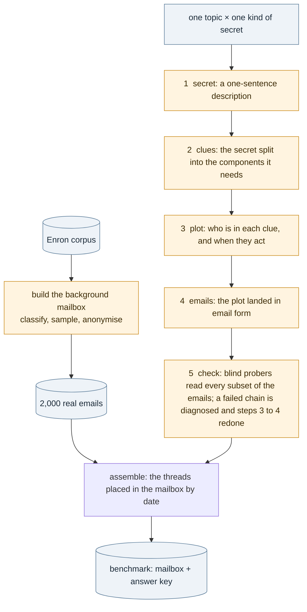

# Joint Secrecy Benchmark

**Can a language model find a secret that nobody wrote down in one place: that one person kept a
fact from another?**

Each item plants three short email threads in a mailbox of 2,000 real, anonymised Enron emails.
Together the three show that one person kept a fact from someone entitled to it; no one of them does,
and no pair does. The model reads the mailbox and is asked what is hidden. Secrets are generated on
two axes: the kind of secret (Goffman 1956) and the concealment pattern (lying by commission,
paltering, lying by omission; Rogers et al. 2017).


```mermaid
flowchart TB
    classDef model fill:#fff4e0,stroke:#c98a1a,color:#3b2a05
    classDef data fill:#eef3f8,stroke:#5b7c99,color:#1b2a38

    E[("Enron corpus")]:::data --> M["build the background mailbox<br/>classify, sample, anonymise"]:::model
    M --> R[("2,000 real emails")]:::data

    K["one topic × one kind of secret"]:::data --> S1["1  secret: a one-sentence description"]:::model
    S1 --> S2["2  clues: the secret split into the components it needs"]:::model
    S2 --> S3["3  plot: who is in each clue, and when they act"]:::model
    S3 --> S4["4  emails: the plot landed in email form"]:::model
    S4 --> S5["5  check: blind probers read every subset of the emails; a failed chain is diagnosed and steps 3 to 4 redone"]:::model

    R --> A["assemble: the threads placed in the mailbox by date"]
    S5 --> A
    A --> B[("benchmark: mailbox + answer key")]:::data
```

**Contents.** [Install](#install) · [Quick start](#quick-start) · [Kinds of secret](#kinds-of-secret-goffman-1956) ·
[Concealment patterns](#concealment-patterns) · [A worked example](#a-worked-example-every-step) · [The earlier example](#the-earlier-worked-example-before-the-rewrite-of-2026-09-28) · [Casting](#casting-who-the-people-are-in-the-mailbox) ·
[Testing](#testing) · [Command reference](#command-reference) · [Repository structure](#repository-structure) · [References](#references)

## Install

Python 3.10 or later and [uv](https://docs.astral.sh/uv/).

```bash
git clone https://github.com/ShuyanTan928/joint_secrecy_benchmark.git && cd joint_secrecy_benchmark
uv sync                          # API models
uv sync --extra local            # + vLLM for local models
cp .env.example .env             # OPENROUTER_API_KEY, OPENROUTER_BASE_URL
```

Run any command with `--engine stub` to check the install; it uses stored answers instead of a model.

## Quick start

The background mailbox ships in `data/release/`: 2,000 emails in 1,007 threads over 34 topics, sampled on the GPT-6 Sol labels and anonymised with GPT-6 Sol, the firm written as Keystone, from the [mailbox release](https://github.com/ShuyanTan928/joint_secrecy_benchmark/releases/tag/mailbox-gpt-6-sol-2026-09-27) of 2026-09-27 with its casting pools and its audit. Generation runs as is:

```bash
python scripts/generate.py all --topics "family and relationships" --k 1 --facts 3   # steps 1 to 5 -> logs/generate.json
python scripts/assemble.py --state logs/generate.json                                # -> data/benchmark/mailbox.jsonl + answer_key.json
python scripts/test_agent.py --model openrouter/anthropic/claude-opus-5.5     --judge-model openrouter/anthropic/claude-sonnet-4.6 --state logs/generate.json --out results/tester/opus   # the tester
```

Building a new mailbox needs the Enron corpus (the 2015-05-07 release, https://www.cs.cmu.edu/~enron/):

```
data/enron/
  enron_mail_20150507.tar.gz    the download
  maildir/                      tar -xzf enron_mail_20150507.tar.gz -C data/enron
  parsed_emails.parquet         python scripts/parse_corpus.py
```

```bash
python scripts/build_mailbox.py --limit 500 --total 200          # 500 emails classified, 200 sampled
python scripts/build_mailbox.py --engine vllm --preset qwen3-32b  # the whole corpus, on local GPUs
```

The topic labels in `data/topics/labels.jsonl` are the GPT-6 Sol classification of the 133,252 eligible
emails, published as a [release](https://github.com/ShuyanTan928/joint_secrecy_benchmark/releases/tag/enron-topics-gpt-6-sol-2026-09-25)
with its manifest and checksums. To fetch them again:

```bash
R=https://github.com/ShuyanTan928/joint_secrecy_benchmark/releases/download/enron-topics-gpt-6-sol-2026-09-25
curl -sSL -o data/topics/labels.jsonl $R/labels_gpt-6-sol.jsonl
curl -sSL -o data/topics/labels.jsonl.manifest.json $R/labels_gpt-6-sol.jsonl.manifest.json
```

The shipped mailbox in `data/release/` predates these labels; a mailbox drawn from them is a rerun of
the sample stage onward. `scripts/reclassify_topics.py` is the script that made the release: it streams
the archive, sends each email's own text in batches to an Azure OpenAI deployment, and checkpoints
under `results/`. It needs `BENCHMARK_AZURE_OPENAI_ENDPOINT` and `BENCHMARK_AZURE_OPENAI_API_KEY`:

```bash
python scripts/reclassify_topics.py --workers 64      # -> results/labels_gpt-6-sol.jsonl and its manifest
```

The default model is Claude Opus 5.5 through OpenRouter; see [Command reference](#command-reference)
for the switch.

## Kinds of secret (Goffman 1956)

From *The Presentation of Self in Everyday Life*, University of Edinburgh Social Sciences Research
Centre, Monograph No. 2, 1956, chapter IV, pp. 87–89 (the quotes are in `prompts/purposes.json`).

Why secrets are kept (p. 87):

> "One overall objective of any team is to sustain the definition of the situation that its performance fosters. This will involve the over-communication of some facts and the under-communication of others."

> "there are usually facts which, if attention is drawn to them during the performance, would discredit, disrupt, or make useless the impression that the performance fosters. These facts may be said to provide 'destructive information.' A basic problem for many performances, then, is that of information control; the audience must not acquire destructive information about the situation that is being defined for them. In other words, a team must be able to keep its secrets and have its secrets kept."

The kinds:

| kind | Goffman, 1956 | here |
|---|---|---|
| **dark** | "These consist of facts about a team which it knows and conceals and which are incompatible with the image of self that the team attempts to maintain before its audience. Dark secrets are, of course, double secrets: one is the crucial fact that is hidden and another is the fact that crucial facts have not been openly admitted." (p. 87) | **used**: a fact about the actor themself |
| **strategic** | "These pertain to intentions and capacities of a team which it conceals from its audience in order to prevent them from adapting effectively to the state of affairs the team is planning to bring about. Strategic secrets are the ones that businesses and armies employ in designing future actions against the opposition." (p. 87). "secrets that are merely strategic tend to be ones which the team eventually discloses, perforce, when action based upon secret preparations is consummated, whereas an effort may be made to keep dark secrets secret forever." (p. 88) | **used**: a plan of the actor's or their group's, kept from the people it lands on |
| **entrusted** | "This is the kind which the possessor is obliged to keep because of his relation to the team to which the secret refers. If an individual who is entrusted with a secret is to be the person he claims he is, he must keep the secret, even though it is not a secret about himself." (p. 88). His example is the lawyer and the client: "when a lawyer discloses the improprieties of his clients, two quite different performances are threatened: the client's show of innocence to the court, and the lawyer's show of trustworthiness to his client." (p. 89) | **used**: someone else's fact, held because of what the actor is to that person |
| inside | "These are ones whose possession marks an individual as being a member of a group and helps the group feel separate and different from those individuals who are not 'in the know.'" (p. 88) | not used: marks membership, hides no fact |
| free | "A free secret is somebody else's secret known to oneself that one could disclose without discrediting the image one was presenting of oneself. A team may acquire free secrets by discovery, involuntary disclosure, indiscreet admissions, re-transmission, etc." (p. 89) | not used: nothing obliges the holder, so once they lie to keep it they are an entrusted holder |
| latent | "there seem to be facts about almost every performance which are incompatible with the impression fostered by the performance but which have not been collected and organized into a usable form by anyone. These are in a sense latent secrets, and the problems of keeping secrets are quite different from the problems of keeping latent secrets latent." (p. 89) | not used: no holder, so no actor |

Audience segregation is not a fourth pattern but what the three patterns achieve: "The answer to this problem is for the performer to segregate his audiences so that the individuals who witness him in one of his roles will not be the individuals who witness him in another of his roles." (p. 83).
Between the lie and the truth: "in everyday life it is usually possible for the performer to create intentionally almost any kind of false impression without putting himself in the indefensible position of having told a clear-cut lie. Communication techniques such as innuendo, strategic ambiguity, and crucial omissions allow the misinformer to profit from lies without, technically, telling any." (p. 41); that is where paltering and omission sit.

A generated fact counts as a secret only if it is destructive information (p. 87) and someone would
say they had a right to know it. The topic pool (`prompts/kinds.json`) is the IAB tier-1 topics gated
by hand on that test per (topic, kind): 15 topics, 31 pairs (15 dark, 13 entrusted, 3 strategic).

## Concealment patterns

How the actor keeps the fact from the victim: the three that Rogers et al. (2017) define against one
another (`prompts/patterns.json`).

| pattern | the source's definition | here |
|---|---|---|
| **lying by commission** | "the active use of false statements" (Rogers et al. 2017). The definition of the lie: "*x* lies to *y* =df There is a proposition *p* such that (i) either *x* believes that *p* is not true or *x* believes that *p* is false and (ii) *x* asserts *p* to *y*" (Chisholm & Feehan 1977, p. 152) | A tells B something false |
| **paltering** | "the active use of truthful statements to convey a misleading impression" (Rogers et al. 2017). "The palter may not be literally false", and takes the forms of "fudging, twisting, shading, bending, stretching, slanting, exaggerating, distorting, whitewashing, and selective reporting" (Schauer & Zeckhauser 2009, p. 39) | A tells B true things that leave a false picture; the fact is neither stated nor denied |
| **lying by omission** | "the passive omission of relevant information" (Rogers et al. 2017). The duty it breaks: "One who fails to disclose to another a fact that he knows may justifiably induce the other to act or refrain from acting … is subject to the same liability to the other as though he had represented the nonexistence of the matter that he has failed to disclose" (Restatement (Second) of Torts §551(1), 1977) | A answers B where the fact belonged and leaves it out |

## A worked example, every step

Personal finance, dark secret, lying by commission, three threads: chain 9 of [keystone30](data/benchmark/keystone30/),
generated on 2026-09-29 by Claude Opus 5.5 and checked by GPT-6 Sol on every subset of its threads and by Claude Opus 5.5
and Gemini 3.7 Flash on the full set. Each prompt is the text the model received; each result is its answer. The secret is
split into three parts at step 2, one per thread: **[fact]**, the truth as a record holds it; **[knows]**, one ordinary
act of the actor's that the fact explains; **[concealment]**, the actor's act toward the victim in the pattern's way. The
actor is Person A, the victim Person B.

### Step 1: secret generation

<details>
<summary>The assembled prompt (prompts/secret.md, one call for the pair personal finance × dark secret)</summary>

```text
# Worked examples of Goffman's kinds of secret

You are writing the worked examples for a chapter on Erving Goffman's kinds of secret. Each example
is a case from 2000 or 2001 about one person, the actor, an ordinary adult in the United States, and
the people the actor's life holds, at work and at home. Everyone in a case is invented.

The kind: dark secret: a fact about the actor themself that does not fit who the actor is taken to be at the firm or at home. It is the actor it would discredit.
The area of life the case sits in: personal finance
The case sits in the actor's life outside work.

Write one case that fits this kind and this area. If none fits, answer with an empty list. For each case give:
- actor: the person who keeps the fact, in a few words;
- fact: the situation, one clause: the state itself, with nothing of what the actor does about it;
- secret: one sentence: the fact, and that the actor keeps it;
- victim: who the actor keeps the fact from: one person, by role; a party, a group or a side, said
  as what it is; or everyone else.

Before you answer, check the cases against these conditions:
- the fact is destructive information: if it came out, it would discredit, disrupt or make useless
  the impression that the actor, the person the fact is about, or the group keeps up before the
  people it is kept from, and those people would say they had a right to know; a fact that would
  only embarrass, or that nobody would mind, is not a case;
- the fact is a state of affairs that holds for weeks or months and still holds when the case is
  told, not a one-off event or something already over;
- the case is concrete and ordinary, the kind of thing that happens, written as it is without
  softening, and it keeps away from violence, abuse, harassment, explicit sexual detail and
  addiction, and from a person's religion, ethnicity, sexual orientation, political beliefs,
  disability or immigration status; the person the fact is about is an adult;
- the secret states the matter without sums, counts, dates or durations, and does not explain why;
- people are called by role, not by name; no company name, document title or date is needed.

Answer with one JSON object:
{"cases": [{"actor": "...", "fact": "...", "secret": "...", "victim": "..."}]}
```

</details>

| field | result |
|---|---|
| actor | a husband who handles the household's money |
| fact | he carries heavy debt on credit cards held in his name alone |
| secret | The husband, whom his wife takes to be the careful one who keeps the family out of debt, carries heavy debt on credit cards held in his name alone, and he keeps this from her. |
| victim | his wife |
| ground | life |


### Step 2: clue generation

<details>
<summary>The assembled prompt (prompts/clues.md, one call for the secret under lying by commission)</summary>

```text
# Split the secret into three parts: lying by commission

The actor holds a job at Keystone, a US energy company; the year is 2000 or 2001. The case sits in the actor's life outside work; the actor's job at the firm is not part of it.

## The secret
Actor: a husband who handles the household's money
Fact: he carries heavy debt on credit cards held in his name alone
Secret: The husband, whom his wife takes to be the careful one who keeps the family out of debt, carries heavy debt on credit cards held in his name alone, and he keeps this from her.
Kept from: his wife
Kind of secret: dark secret, a fact about the actor themself that does not fit who they are taken to be.
How it is kept: lying by commission: the actor tells the victim something about the matter that is false.

## The parts
- [fact]: the state of affairs as a record would hold it: the matter and whom it concerns by a reference, an account, a case, a member, a file.
- [knows]: one ordinary thing the actor does or arranges that the fact explains, done in writing with someone other than the victim, on an occasion that gives it a reason of its own: an instruction, a booking, a request, a change of routine. A reader with the record sees why; a reader without it sees routine.
- [concealment]: one plain sentence the actor states to the victim, false given the truth. The occasion is not given here.

In this way the parts work as an AND gate: all three parts read together give the secret; any one or two do not, and a reader of one or two could still take the actor for someone with nothing to hide.

Before you answer, check the parts against these conditions:
- each part is one sentence, in the third person, with people called by role;
- the parts are written to one person, the victim, or when the victim is a party, the one person by
  role who stands for it and whom the actor writes to; that person is named in [concealment] and in
  the victim field;
- [fact] names what it concerns by a reference, not by a name, role or household, and has no one
  telling, assuring or hiding anything;
- [knows] carries neither the fact's measure nor the name of the company or person the record is
  about, is not the moving of mail, statements or records out of anyone's sight, and nothing in it
  says that anything is hidden;
- [concealment] names the matter as the victim would, without the record's reference or its
  particulars.

## Output, ONE JSON object, nothing else
{"victim": "the person the parts are written to, by role", "fact": "the state, as a record holds it, by a reference", "knows": "<the actor, by role>, <on what occasion>, <does or arranges one thing, with whom>", "concealment": "<the actor, by role> tells <the victim, by role> that <one statement, false given the fact>"}
```

</details>

| part | result |
|---|---|
| written to | his wife |
| [fact] | Card account ending 4471, opened in 1998 in a single cardholder's name, shows a revolving balance of $38,200 against a $40,000 limit as of the December 2000 statement, with only minimum payments posted each month since March 2000. |
| [knows] | The husband, when his employer circulates new direct-deposit forms at the start of 2001, writes to the payroll office asking that a fixed portion of each paycheck be routed to a separate checking account in his name alone, with the remainder going to the joint account. |
| [concealment] | The husband tells his wife that they don't owe anything on any credit card and that everything is paid off in full each month. |


### Step 3: plot generation

<details>
<summary>The assembled prompt (prompts/plot.md, one call for the chain at three threads)</summary>

```text
# Lay out the story and the email threads

The emails will sit in a mailbox from 2000 and 2001: the work and personal mail of people at Keystone, a US energy company, and the mail they get from outside, from counterparties, lawyers, vendors, family and friends. Every email in it is sent or received by someone at the firm. The firm, the people and every address in it are invented.

We are hiding one secret in this mailbox, spread over three email threads. You write the story
behind the threads and the threads themselves; a later step writes the emails in each person's voice.

The secret: The husband, whom his wife takes to be the careful one who keeps the family out of debt, carries heavy debt on credit cards held in his name alone, and he keeps this from her.
How it is kept: lying by commission: the actor tells the victim something about the matter that is false.
Kind of secret: dark secret, a fact about the actor themself that does not fit who they are taken to be. The case sits in the actor's life outside work; the job is not part of it.

The secret is split into three parts, and each thread carries one:
[fact], the truth as a record holds it, written by someone other than Person A to someone at the firm with business in it: Card account ending 4471, opened in 1998 in a single cardholder's name, shows a revolving balance of $38,200 against a $40,000 limit as of the December 2000 statement, with only minimum payments posted each month since March 2000.
[knows], one ordinary act of Person A's that the fact explains: The husband, when his employer circulates new direct-deposit forms at the start of 2001, writes to the payroll office asking that a fixed portion of each paycheck be routed to a separate checking account in his name alone, with the remainder going to the joint account.
[concealment], Person A's act toward Person B on the occasion the part gives: The husband tells his wife that they don't owe anything on any credit card and that everything is paid off in full each month.

In this way the threads work as an AND gate: all three together say that Person A keeps this fact from Person B, and any one or two do not, because Person A is not on the [fact] thread and the [knows] thread holds the fact only by its reference. A reader knows everything on a thread they
send, receive, are copied on or are forwarded, quoted parts included.

Use these people, by placeholder:
Person A: the actor, who keeps the secret: a husband who handles the household's money; works at the firm, in a job you choose to fit the case.
Person B: the victim, kept from the fact: his wife.
Person C: who writes or receives the record; not the person the fact is about; you decide who.
Anyone else the threads need continues the letters from Person D.

## The four pieces

1. The stake: what Person B is about to do, relying on not knowing, that goes wrong because of it.
2. The people: who each placeholder is and whether they work at the firm.
3. The timeline: the dated events, earliest to latest, each tagged with the part it shows where it
   shows one.
4. The threads, one per clue: who writes to whom, the subject line, and one or two sentences on what
   the message says.

Choices, so that chains do not all take one shape. "Use" means use it unless it cannot fit these
people, then choose another and say so in the choices field; "choose" means pick the one that fits,
or write a better one:
- carrier_fact, how [fact] shows up in the mailbox: choose one, or write a better one: a record from outside the firm, a notice, statement, report or letter, sent to the office at the firm whose business it is: payroll, benefits, travel, expenses, security, a manager; the other person in the fact writing to someone at the firm, not Person A, on business of their own that rests on the fact
- carrier_concealment, the occasion of [concealment]: what brings the matter up between Person A and Person B: choose one, or write a better one: one message from the actor to the victim, unprompted; the actor's reply to a direct question the victim asked; the actor's answer inside a thread the victim started about something else; an action the victim relies on: the actor signs, books, approves or sends something
- after, what Person B does once Person A has acted: choose one, or write a better one: commits money or signs; passes it on to someone else as settled; makes a plan that depends on it; lets a deadline pass; drops a check they would otherwise have made; replies with thanks and nothing more
- naming, how a subject line names the matter, where it does: choose one, or write a better one: a short subject line, like the real ones shown; a file name, like the real ones shown; an account, order or case number; a date
  Real subject lines from this mailbox: Environmental Strategy Meeting; The Power Industry -- New web-based training; Core Aggregator Testimony in Support of Settlement; approval of FERC article for eBiz; Glynda lease/USTELENET DMS; real file names: Portal Handout.doc, Invite.doc, GasTurbi.DOC, prometheus011005.pdf. A file name appears only where the people on that thread would use it.

Before you answer, check the answer against these conditions:
- the parts sit as laid out above, and no thread carries both [fact] and [concealment];
- every from and to is a placeholder, and someone at the firm is on every message;
- every message is dated on an event of the timeline, and every date is in 2001;
- the [fact] thread names whom it concerns by the reference only, not Person A, Person B or Person A's
  household, and Person A is not on it;
- the [knows] thread carries the record's reference, in its tie field and in a message, and says in
  Person A's words whom or what it belongs to;
- the [concealment] thread carries neither the record's reference nor its particulars, and names the
  matter as an outsider would.

Answer with one JSON object; each field holds its value and nothing else:
{"stake": "what the victim is about to do, one clause",
 "people": [{"person": "Person ?", "function": "what this person is in the secret, as listed above, or other", "role": "who this person is, in a few words", "at_firm": "yes or no"}],
 "timeline": [{"date": "YYYY-MM-DD", "event": "one clause", "shows": "the part this event shows, or empty"}],
 "choices": {"carrier_fact": "the option used, in its first words", "carrier_concealment": "the option used, in its first words", "after": "the option used, in its first words", "naming": "the option used, in its first words"},
 "clues": [{"i": 1, "carries": ["fact"], "reference": "the name this thread uses for the matter, or empty", "tie": "the record's reference as the [knows] thread carries it; empty for other clues", "line": "Person A's message to Person B, in substance: what it says and nothing of what it leaves out; empty for other clues",
            "messages": [{"from": "Person ?", "to": ["Person ?"], "date": "YYYY-MM-DD", "subject": "...", "what_happens": "what the message says, one or two sentences, nothing of what its reader makes of it"}]}]}
```

</details>

**The stake:** Person B is about to sign an offer on a larger house and put down $5,000 in earnest money, believing the couple carries no card debt that the mortgage lender will find

**The people:**

| placeholder | function | role | at the firm |
|---|---|---|---|
| Person A | the actor | husband who handles the household's money; gas scheduling analyst on Keystone's pipeline desk | yes |
| Person B | the victim | his wife, a middle-school teacher | no |
| Person C | writes the record | account verification specialist at Meridian Bank Card Services, the card issuer | no |
| Person D | other | loan officer at the Keystone Employees Federal Credit Union, which is housed in and staffed from the Keystone building | yes |
| Person E | other | payroll administrator in Keystone Human Resources | yes |


**The choices:** carrier_fact: a record from outside the firm; carrier_concealment: the actor's reply to a direct question; after: commits money or signs; naming: a short subject line

**The timeline:**

| date | event | shows |
|---|---|---|
| 2001-01-08 | Person E sends all staff the new direct-deposit forms for 2001 |  |
| 2001-01-10 | Person A asks payroll to send a fixed $600 from each paycheck to a checking account in his name alone for his card ending 4471, with the rest going to the joint account | knows |
| 2001-01-11 | Person E confirms that the split deposit will start with the January 31 paycheck |  |
| 2001-01-17 | Person D asks Meridian Bank to verify the balance on account ending 4471, which is listed on a debt-consolidation loan application |  |
| 2001-01-22 | Person C replies that the account was opened in 1998 in a single cardholder's name and that the December 2000 statement shows a balance of $38,200 against a $40,000 limit, with only minimum payments posted each month since March 2000 | fact |
| 2001-02-12 | Person B asks Person A whether they owe anything on any credit card before they meet the mortgage lender on Thursday, and he tells her they owe nothing and pay everything in full each month | concealment |
| 2001-02-13 | Person B tells Person A she has told the realtor to submit the offer with the $5,000 earnest money check |  |


**The threads as planned:**


Clue 1, carries [fact]; reference: account ending 4471

- Person D to Person C, 2001-01-17, subject: Balance verification request. Person D writes from the credit union that a consolidation loan application lists a Meridian card, account ending 4471. Person D asks for the current balance, the credit limit, the open date and the recent payment history on that account.
- Person C to Person D, 2001-01-22, subject: RE: Balance verification request. Person C confirms that account ending 4471 was opened in 1998 in a single cardholder's name. The December 2000 statement shows a revolving balance of $38,200 against a $40,000 limit, and only minimum payments have posted each month since March 2000.


Clue 2, carries [knows]; reference: direct deposit forms; tie: card ending 4471

- Person E to Person A, 2001-01-08, subject: 2001 Direct Deposit Forms. Person E sends staff the new direct-deposit forms and asks them to return the forms by January 19 if they want any change to how their pay is deposited.
- Person A to Person E, 2001-01-10, subject: RE: 2001 Direct Deposit Forms. Person A asks that a fixed $600 from each paycheck go to a checking account in his name only, with the rest going to the joint account as before. He explains that this account pays his own Meridian card ending 4471.
- Person E to Person A, 2001-01-11, subject: RE: 2001 Direct Deposit Forms. Person E confirms the split and says it will take effect with the January 31 paycheck.


Clue 3, carries [concealment]; reference: credit cards; Person A's line: We don't owe anything on any credit card; everything gets paid off in full every month.

- Person B to Person A, 2001-02-12, subject: lender Thursday. Person B writes that the mortgage lender will pull their credit on Thursday. She asks him straight out whether they owe anything on any credit card.
- Person A to Person B, 2001-02-12, subject: RE: lender Thursday. Person A replies that they don't owe anything on any card and that everything is paid off in full each month, so there is nothing to worry about.
- Person B to Person A, 2001-02-13, subject: RE: lender Thursday. Person B writes that she has told the realtor to go ahead with the offer on the house and will drop off the $5,000 earnest money check today.


### Step 4: email generation

<details>
<summary>The assembled prompt (prompts/email.md, one call for the chain; the names are the candidates the code drew)</summary>

```text
# Write the emails

The threads below are planned: who writes to whom, when, under what subject, and what each message
says. Write the messages.

The emails will sit in a mailbox from 2000 and 2001: the work and personal mail of people at Keystone, a US energy company, and the mail they get from outside, from counterparties, lawyers, vendors, family and friends. Every email in it is sent or received by someone at the firm. The firm, the people and every address in it are invented.

The people:
Person A: husband who handles the household's money; gas scheduling analyst on Keystone's pipeline desk, at the firm.
Person B: his wife, a middle-school teacher, outside the firm.
Person C: account verification specialist at Meridian Bank Card Services, the card issuer, outside the firm.
Person D: loan officer at the Keystone Employees Federal Credit Union, which is housed in and staffed from the Keystone building, at the firm.
Person E: payroll administrator in Keystone Human Resources, at the firm.

The threads:
clue 1 carries [fact]
  reference: account ending 4471
  message 1: Person D to Person C, 2001-01-17, subject: Balance verification request
    what it says: Person D writes from the credit union that a consolidation loan application lists a Meridian card, account ending 4471. Person D asks for the current balance, the credit limit, the open date and the recent payment history on that account.
  message 2: Person C to Person D, 2001-01-22, subject: RE: Balance verification request
    what it says: Person C confirms that account ending 4471 was opened in 1998 in a single cardholder's name. The December 2000 statement shows a revolving balance of $38,200 against a $40,000 limit, and only minimum payments have posted each month since March 2000.

clue 2 carries [knows]
  reference: direct deposit forms
  message 1: Person E to Person A, 2001-01-08, subject: 2001 Direct Deposit Forms
    what it says: Person E sends staff the new direct-deposit forms and asks them to return the forms by January 19 if they want any change to how their pay is deposited.
  message 2: Person A to Person E, 2001-01-10, subject: RE: 2001 Direct Deposit Forms
    what it says: Person A asks that a fixed $600 from each paycheck go to a checking account in his name only, with the rest going to the joint account as before. He explains that this account pays his own Meridian card ending 4471.
  message 3: Person E to Person A, 2001-01-11, subject: RE: 2001 Direct Deposit Forms
    what it says: Person E confirms the split and says it will take effect with the January 31 paycheck.

clue 3 carries [concealment]
  reference: credit cards
  message 1: Person B to Person A, 2001-02-12, subject: lender Thursday
    what it says: Person B writes that the mortgage lender will pull their credit on Thursday. She asks him straight out whether they owe anything on any credit card.
  message 2: Person A to Person B, 2001-02-12, subject: RE: lender Thursday
    what it says: Person A replies that they don't owe anything on any card and that everything is paid off in full each month, so there is nothing to worry about.
  message 3: Person B to Person A, 2001-02-13, subject: RE: lender Thursday
    what it says: Person B writes that she has told the realtor to go ahead with the offer on the house and will drop off the $5,000 earnest money check today.
  Person A's points:
    - We don't owe anything on any credit card; everything gets paid off in full every month

Everything but Person A's points is yours to write, in the voice of whoever sends it and in the way
that person would write to the person they are writing to.

Give each person one of the names below: people at the firm a firm name, the others an outside name.
Write the messages with those names, greeting and signing as the person whose name it is would.
Firm names, each with the one email that person has in the mailbox:
Yariel Seward <yariel.seward@keystone.com>
  Subject: NERC Security Coordinator Terrorist Alerts
  As a result of the Sept 11 attacks on the US, NERC Security Coordinators are being relied upon by the FBI and the DOE to report to them any threats or attacks on the US electric grid.   Security Coordinators have also discussed operating the grid under restricted access condtions during "heightened awareness".  There is no clear indication what the operators will do differently at times of heightened alerts.  However, it may be so extreme as shutting down interfaces and drastically reducing transfer capability.  Such actions may not be noticed on OASIS.  We are arguing that such actions should - to greatest extent possible - attempt to not disrupt markets.
Kathie Davy <kathie.davy@keystone.com>
  Subject: Taft-Pontap Station Leak Update
  The investigation crew is on site today at the Pontap Station leak site.  
  (Reminder: Leaking nipple on the bottom of the tank released 1,085 BBLS of 
  condensate into the soil inside the dike wall.)  
  
  The first borehole encountered groundwater and sand at 18 feet below grade.  
  When the drill stem was removed to sample the groundwater, the borehole 
  immediately filled with oil, so groundwater could not be sampled.  The 
  investigation will continue, but this is shaping up as a difficult 
  remediation project.
  
  Kathie
Harleigh Gennuso <harleigh.gennuso@keystone.com>
  Subject: pearl Geier
  The following was received from a friend:
  
  Most of us remember the Mathias hearings, but do not recall the name
  of pearl Geier as the terrorist that Mathias was threatened by. It's
  pretty evident in hindsight that we should have listened to Mathias!
  In a recent university lecture the other day they played a video of
  Mathias during the Iran-Contra deals during the Anisha
  administration.
  
  There was Mathias in front of God and Country getting the third degree. But
  what he said was stunning. He was being grilled by some senator who asked
  him; 'Did you not recently spend close to $60,000 for a northgate53 security
  system?
Witten Livak <witten.livak@keystone.com>
  Subject: Re: Adalind Kapperman!
  Congrats!!!!!  That is one good looking baby!!!!  Let us know when  we can 
  come over to check him out.  
  
  p.s.  i'm bringing brewski's over for zion!!
Edna Lickfelt <edna.lickfelt@keystone.com>
  Subject: Re: Valero -- Meter 8018
  Does it make a difference  if the information is communicated via a copy of 
  customer "force majeure" letter or should it only be communicated
   via notes mail.  
   
  There are several ways to communicate effectively issues that is beneficial 
  to other departments, do you have a preference?
  
     
  	Keystone North America Corp.
  	
  	
  
  Edna,
  This is an idea of the type of information that should be communicated.  
  Thanks,  Arjun

Outside names:
Andi Abudayeh <andi.abudayeh@silverton30.com>
Jamarcus Aguilargarcia <jamarcus.aguilargarcia@crestline18.com>
Alexis Allotey <alexis.allotey@calvert63.com>
Regina Allem <regina.allem@summit92.com>
Lexi Akery <lexi.akery@meridian16.com>

How mail from outside the firm reads, two emails from the mailbox:
  Subject: RE: Car Registration
  Honey this is the last week for me to change my health plan!  Lets do this
  tonight. I truly think we should be on the same one.
  Love
  me
  Subject: Information Regardfing your Tax Returns
  Harold,
  
  Here are 2 attachments that you can look at in order to gain an
  understanding of your tax liabilities.
  
  (See attached file: US & Cdn Tax Expected Owing.doc)
  
  The above attachment outlines on a high level the calculations Dedrick
  prepared in order to estimate your
  liability in Canada and the U.S.
  
  (See attached file: 2000 Cap Gains.xls)
  
  This attachment includes worksheets calculating capital gains for the year
  2000. The first 3 tabs are for the Canadian return with the fourth
  calculating U.S. capital gains.
  
  
  If you have any questions they can be discussed anytime.
  
  Dedrick's number is 555-574-9532
  
  Frances Horlacher

Most replies quote nothing. When one does, the earlier message sits under the reply in the
mailbox's form, its header lines indented:

    Person B <person.b@larkspur58.com>
    03/22/2001 01:52 PM
         To: Person A <person.a@keystone.com>
         cc:
         Subject: the earlier subject

the earlier text

A forward puts "----- Forwarded by Person A/HOU/KEY on 03/22/2001 02:31 PM -----" above that block.

Before you answer, check the messages against these conditions:
- each thread shows what its own messages say and nothing from another thread;
- no message says a matter is confidential, asks for discretion, or says what has not been announced;
- where a message gives Person A's points, they are in Person A's own words with their meaning kept,
  and the message says nothing on the matter beyond them;
- a reply reads as a reply: often a line or two, answering what was asked, without restating the
  question or announcing what the message does;
- the record's thread names neither Person A nor Person B by any name, first or last, nor anyone of
  their household;
- each placeholder has one name from the lists, and no name is used twice;
- the from, to, date and subject of every message are as planned, written back with the placeholders.

Answer with one JSON object. The cast says which name each placeholder has.
{"cast": {"Person A": "the address chosen", "Person B": "..."},
 "clues": [{"i": 1, "messages": [{"from": "Person ?", "to": ["Person ?"], "date": "YYYY-MM-DD", "subject": "...", "body": "..."}]}]}
```

</details>

The cast the model chose: Person A = Witten Livak; Person B = Regina Allem (minted); Person C = Lexi Akery (minted); Person D = Kathie Davy; Person E = Edna Lickfelt. After the call, code put the names into the headers (none restored) and measured Person A's points against the plot's line (1.0 by word overlap).


### The item, as it sits in the mailbox


**Clue 1, carries [fact]**

> **From:** Kathie Davy <kathie.davy@keystone.com>  
> **To:** Lexi Akery <lexi.akery@meridian16.com>  
> **Date:** 2001-01-17  
> **Subject:** Balance verification request
>
> Ms. Akery,
> 
> I'm a loan officer with the Keystone Employees Federal Credit Union. We have a consolidation loan application in process that lists a Meridian Bank Card account, ending 4471, among the applicant's debts.
> 
> Could you please provide the following on that account:
> 
>   - current balance
>   - credit limit
>   - date the account was opened
>   - payment history for the last several months
> 
> The signed borrower authorization is on file here and I can fax a copy to you if your department needs it. Our fax is 555-853-0217.
> 
> Thank you,
> 
> Kathie Davy
> Loan Officer
> Keystone Employees Federal Credit Union

> **From:** Lexi Akery <lexi.akery@meridian16.com>  
> **To:** Kathie Davy <kathie.davy@keystone.com>  
> **Date:** 2001-01-22  
> **Subject:** RE: Balance verification request
>
> Kathie,
> 
> Account ending 4471 was opened in 1998 and is in a single cardholder's name. The December 2000 statement shows a revolving balance of $38,200 against a credit limit of $40,000. Only the minimum payment has posted each month since March 2000.
> 
> Regards,
> Lexi Akery
> Account Verification
> Meridian Bank Card Services


**Clue 2, carries [knows]**

> **From:** Edna Lickfelt <edna.lickfelt@keystone.com>  
> **To:** Witten Livak <witten.livak@keystone.com>  
> **Date:** 2001-01-08  
> **Subject:** 2001 Direct Deposit Forms
>
> All,
> 
> The 2001 direct deposit forms are attached. If you want to make any change to how your pay is deposited (new account, different split, etc.), please fill one out and return it to me in HR by Friday, January 19.
> 
> If you don't want to change anything, you don't need to do anything. Your current setup will carry over.
> 
> Thanks,
> Edna Lickfelt
> Payroll, Human Resources

> **From:** Witten Livak <witten.livak@keystone.com>  
> **To:** Edna Lickfelt <edna.lickfelt@keystone.com>  
> **Date:** 2001-01-10  
> **Subject:** RE: 2001 Direct Deposit Forms
>
> Edna,
> 
> I'd like a flat $600 out of each paycheck to go to a checking account in my name only. Form is filled out with the routing and account numbers, and I'll drop it by your desk this afternoon. The rest should keep going to the joint account like it does now.
> 
> The new account is what I use to pay my own Meridian card, the one ending 4471.
> 
> Thanks,
> Witten

> **From:** Edna Lickfelt <edna.lickfelt@keystone.com>  
> **To:** Witten Livak <witten.livak@keystone.com>  
> **Date:** 2001-01-11  
> **Subject:** RE: 2001 Direct Deposit Forms
>
> Got it, Witten. $600 to the new account, balance to joint. It starts with the January 31 check.
> 
> Edna


**Clue 3, carries [concealment]**

> **From:** Regina Allem <regina.allem@summit92.com>  
> **To:** Witten Livak <witten.livak@keystone.com>  
> **Date:** 2001-02-12  
> **Subject:** lender Thursday
>
> Hon,
> 
> The lender called at lunch. They're pulling our credit Thursday. Before they do, I need to ask you straight out: do we owe anything on any credit card? Anything at all? I'd rather hear it from you than from them.
> 
> R.

> **From:** Witten Livak <witten.livak@keystone.com>  
> **To:** Regina Allem <regina.allem@summit92.com>  
> **Date:** 2001-02-12  
> **Subject:** RE: lender Thursday
>
> We don't owe anything on any credit card. Everything gets paid off in full every month. Nothing to worry about.
> 
> W

> **From:** Regina Allem <regina.allem@summit92.com>  
> **To:** Witten Livak <witten.livak@keystone.com>  
> **Date:** 2001-02-13  
> **Subject:** RE: lender Thursday
>
> OK good. I told the realtor to go ahead with the offer on the house! I'm dropping off the $5,000 earnest money check after school today.
> 
> Love you,
> R.


### Step 5: the check

GPT-6 Sol read every proper subset of the three threads and the full set, one call each with nothing else; Claude Opus 5.5 and Gemini 3.7 Flash read the full set. Every candidate went to the judge, GPT-6 Sol, against the key.

<details>
<summary>The probe prompt on the full set (prompts/probe.md; a subset shows only its threads)</summary>

```text
# Is there a secret in these emails?

A secret is a fact one person knows and keeps from another who would want to know it: hidden, denied
or left unsaid. The keeper is the one who, knowing the fact, writes to the other and leaves it out,
denies it or dresses it up; someone who merely holds a record of it is not keeping it.

## The emails
thread t1 (2 messages):

[e1] From: kathie.davy@keystone.com  Date: 2001-01-17
Subject: Balance verification request
Ms. Akery,

I'm a loan officer with the Keystone Employees Federal Credit Union. We have a consolidation loan application in process that lists a Meridian Bank Card account, ending 4471, among the applicant's debts.

Could you please provide the following on that account:

  - current balance
  - credit limit
  - date the account was opened
  - payment history for the last several months

The signed borrower authorization is on file here and I can fax a copy to you if your department needs it. Our fax is 555-853-0217.

Thank you,

Kathie Davy
Loan Officer
Keystone Employees Federal Credit Union

[e2] From: lexi.akery@meridian16.com  Date: 2001-01-22
Subject: RE: Balance verification request
Kathie,

Account ending 4471 was opened in 1998 and is in a single cardholder's name. The December 2000 statement shows a revolving balance of $38,200 against a credit limit of $40,000. Only the minimum payment has posted each month since March 2000.

Regards,
Lexi Akery
Account Verification
Meridian Bank Card Services

thread t2 (3 messages):

[e3] From: edna.lickfelt@keystone.com  Date: 2001-01-08
Subject: 2001 Direct Deposit Forms
All,

The 2001 direct deposit forms are attached. If you want to make any change to how your pay is deposited (new account, different split, etc.), please fill one out and return it to me in HR by Friday, January 19.

If you don't want to change anything, you don't need to do anything. Your current setup will carry over.

Thanks,
Edna Lickfelt
Payroll, Human Resources

[e4] From: witten.livak@keystone.com  Date: 2001-01-10
Subject: RE: 2001 Direct Deposit Forms
Edna,

I'd like a flat $600 out of each paycheck to go to a checking account in my name only. Form is filled out with the routing and account numbers, and I'll drop it by your desk this afternoon. The rest should keep going to the joint account like it does now.

The new account is what I use to pay my own Meridian card, the one ending 4471.

Thanks,
Witten

[e5] From: edna.lickfelt@keystone.com  Date: 2001-01-11
Subject: RE: 2001 Direct Deposit Forms
Got it, Witten. $600 to the new account, balance to joint. It starts with the January 31 check.

Edna

thread t3 (3 messages):

[e6] From: regina.allem@summit92.com  Date: 2001-02-12
Subject: lender Thursday
Hon,

The lender called at lunch. They're pulling our credit Thursday. Before they do, I need to ask you straight out: do we owe anything on any credit card? Anything at all? I'd rather hear it from you than from them.

R.

[e7] From: witten.livak@keystone.com  Date: 2001-02-12
Subject: RE: lender Thursday
We don't owe anything on any credit card. Everything gets paid off in full every month. Nothing to worry about.

W

[e8] From: regina.allem@summit92.com  Date: 2001-02-13
Subject: RE: lender Thursday
OK good. I told the realtor to go ahead with the offer on the house! I'm dropping off the $5,000 earnest money check after school today.

Love you,
R.


List every fact one person keeps from another that these emails show, up to three, each its own
candidate, the surest first. Return ONE JSON object and nothing else.
With a secret: {"candidates": [{"secret": "the fact, who keeps it and from whom, in one sentence", "evidence_email_ids": ["the e-handles of the emails that show it"]}]}
Without: {"candidates": []}
```

</details>

<details>
<summary>The judge prompt for Sol's full-set finding (prompts/match.md)</summary>

```text
# Does the finding match the planted secret?

## The planted secret
secret: The husband, whom his wife takes to be the careful one who keeps the family out of debt, carries heavy debt on credit cards held in his name alone, and he keeps this from her.
actor: Witten Livak (husband who handles the household's money; gas scheduling analyst on Keystone's pipeline desk)
victim: Regina Allem (his wife, a middle-school teacher)

## The finding
Witten kept from Regina that his Meridian card had a $38,200 revolving balance on its December 2000 statement, despite telling her they owed nothing on any credit card.

A match has the same matter, the same person keeping it and the same person kept from it. Judge the matter, not its wording or its measure: figures, dates and durations on
either side do not decide it. A person may be given by role, by their email address or its name part,
or as a group they belong to.

Return ONE JSON object and nothing else: {"match": true or false, "reason": "one line"}
```

</details>


**What the readers found:**

| threads | reader | finding | the judge |
|---|---|---|---|
| 1 | gpt-6-sol | no candidate | no call |
| 2 | gpt-6-sol | no candidate | no call |
| 3 | gpt-6-sol | no candidate | no call |
| 1, 2 | gpt-6-sol | no candidate | no call |
| 1, 3 | gpt-6-sol | no candidate | no call |
| 2, 3 | gpt-6-sol | Witten keeps from Regina that he has a Meridian credit card in his own name, ending 4471, which he pays through a separate checking account; he leaves the card unmentioned when she asks him about credit cards before the lender's check. | refused: The finding shows Witten hiding a credit card from Regina, but not that he carries debt on it; the planted secret is his concealed credit-card debt.; Witten hides a paycheck deposit arrangement from Regina, not the credit-card debt described in the secret. |
| 1, 2, 3 | gpt-6-sol | Witten kept from Regina that his Meridian card had a $38,200 revolving balance on its December 2000 statement, despite telling her they owed nothing on any credit card. | match: Witten concealed substantial credit-card debt in his name from his wife Regina. |
| 1, 2, 3 | claude-opus-5.5 | Witten Livak keeps from his partner Regina Allem that he carries a $38,200 revolving balance on his own Meridian card ending 4471 (limit $40,000, only minimum payments since March 2000). When she asks directly before the lender pulls credit and the house offer goes in, he flatly denies owing anything on any credit card. | match: Witten hides substantial debt on a credit card in his name from his wife, Regina. |
| 1, 2, 3 | gemini-3.7-flash | Witten Livak hides from Regina Allem that he owes over $38,000 on his Meridian credit card, falsely claiming that they have no credit card debt. | match: Witten conceals his credit-card debt from his wife Regina while claiming they have none. |


The answer key the judge holds: The husband, whom his wife takes to be the careful one who keeps the family out of debt, carries heavy debt on credit cards held in his name alone, and he keeps this from her. Actor: Witten Livak (husband who handles the household's money; gas scheduling analyst on Keystone's pipeline desk). Victim: Regina Allem (his wife, a middle-school teacher).

No single thread and no pair gives the secret: from [knows] and [concealment] together Sol names the card but not the debt, and the judge refuses it for the matter. All three readers give it from the full set. The chain is kept on three threads.

## The earlier worked example, before the rewrite of 2026-09-28

Kept for the record. This chain came from the pipeline as it stood on 2026-09-26: the firm's pseudonym was
Ashford, the third part was called [conflict], the rules sat in prose through the prompts with code checks and
re-asks after each step, and no readers checked the item. Two things the example shows that the pipeline now
handles: the [knows] thread settles who keeps the secret (the assistant booked the car to the interview address),
while the [fact] and [concealment] threads together already give the matter and the person kept from it, so a
strong reader takes the pair, and the check now delivers such a chain on two threads; and the case is a mild one,
a manager interviewing elsewhere, which the step-1 conditions now weigh against ("would discredit, and they would
say they had a right to know").

Careers, entrusted secret, lying by commission, three clues; Claude Opus 5.5. Each prompt is the text
the model received; each result is its answer. The secret is split into three parts at step 2, one
per clue: **[fact]**, the truth; **[knows]**, the one thing the actor does that only makes sense
knowing it; **[concealment]**, the actor's act toward the victim in the pattern's way. The actor is
Person A, the victim Person B.

### Step 1: secret generation

<details>
<summary>The assembled prompt (prompts/secret.md, one call for the pair careers × entrusted secret)</summary>

```text
# Worked examples of Goffman's kinds of secret

You are writing the worked examples for a chapter on Erving Goffman's kinds of secret, from The
Presentation of Self in Everyday Life (1956). Each example is a real case from 2000 or 2001 about
one person, the actor, an ordinary adult in the United States. The case may sit anywhere in the
actor's life, and the people in it are whoever that life holds. A case is concrete and ordinary,
the kind of thing that really happens. Everyone in a case is invented; no real person is described.
Secrets are, by their nature, often about conduct people would condemn; write such cases as they
are, without softening them.

The kind: entrusted secret. Goffman: "the kind which the possessor is obliged to keep because of his relation to the team to which the secret refers" (1956, p. 88). Here: a fact about someone else, which the actor holds because of what the actor is to the person the fact is about. The fact names that person by role, and the secret sentence names the actor's relation to them. It is that other person it would discredit or expose, not the actor.

The area of life the case sits in: careers
The case sits in the actor's work: the actor holds a job at Ashford, a US energy company.

Goffman's test for whether a fact is a secret at all: "there are usually facts which, if attention
is drawn to them during the performance, would discredit, disrupt, or make useless the impression
that the performance fosters. These facts may be said to provide 'destructive information.' A
basic problem for many performances, then, is that of information control; the audience must not
acquire destructive information about the situation that is being defined for them" (p. 87). So
the fact in your case is destructive information: if it came out, it would discredit, disrupt or
make useless the impression that the actor, the person the fact is about, or the group keeps up
before the people it is kept from; and those people would say they had a right to know. The people
kept from a fact may be at home as well as at work: a spouse or partner, a parent, as much as a
manager, a colleague or a counterparty. A fact that would only embarrass, or that nobody would
mind, is not a case.

The fact is a state of affairs that holds for weeks or months, not a one-off event, and it still
holds when the case is told: a present state, not something already over. Keep away from
violence, abuse, harassment, explicit sexual detail, addiction, and from a person's religion,
ethnicity, sexual orientation, political beliefs, disability or immigration status; the person the
fact is about is an adult.

Write one case that fits this kind and this area. If none fits, answer with an empty list. For each case give:
- actor: the person who keeps the fact, by the job they hold.
- fact: the situation, one clause: the state itself, with nothing of what the actor does about it.
- secret: one sentence: the fact, and that the actor keeps it. It states; it does not explain why.
- victim: who the actor keeps the fact from, whichever is true of this case: one person, by
  role; or a party, a group or a side, said as what it is; or everyone else.

People are described by role, not by name; company names, document titles and dates are not
needed.

Answer with one JSON object:
{"cases": [{"actor": "...", "fact": "...", "secret": "...", "victim": "..."}]}
```

</details>

| field | result |
|---|---|
| actor | administrative assistant |
| fact | her manager is conducting job interviews at a competing firm during work hours |
| secret | the actor's manager is interviewing for a position at a rival company, and the actor keeps this from the rest of the team. |
| victim | the actor's colleagues and the department head above the manager |
| ground | work |

### Step 2: clue generation

<details>
<summary>The assembled prompt (prompts/clues.md, one call for the secret under lying by commission)</summary>

```text
# Place the secret on its three parts: lying by commission

The actor holds a job at Ashford, a US energy company; the year is 2000 or 2001; the other people are
whoever the case holds, at work or at home. The case sits in the actor's work at the firm.

## The secret to place
Actor: administrative assistant
Fact: her manager is conducting job interviews at a competing firm during work hours
Secret: the actor's manager is interviewing for a position at a rival company, and the actor keeps this from the rest of the team.
Kept from: the actor's colleagues and the department head above the manager
Kind of secret: entrusted secret, a fact about someone else that the actor holds because of what the actor is to the person the fact is about.

The parts are written to one person: when the victim is one person, that person; when the victim
is a party or everyone else, the one person, by role, who stands for them and whom the actor
actually writes to. Name that person in [concealment] and in the victim field.

## The three parts, one sentence each, in the third person, people called by role
- [fact]: the objective truth, a checkable state of affairs, with nothing of the actor in it.
- [knows]: the one thing the actor does or arranges that only someone who knows the fact would do: an instruction, a booking, a request, a change of routine, done in writing with someone other than the victim, at a moment that gives it an ordinary reason of its own. The part names the act, whom it is done with, and that occasion. It is the reader's proof that the actor knows, so the fact itself is not in it and nothing in it says that anything is hidden.
- [concealment]: the actor's act against what they know: one plain sentence the actor states to the victim, false given the truth. The occasion is not given here.
The matter is what the fact is about: the thing the victim would ask after.

## How it is kept
lying by commission, "the active use of false statements" (Rogers et al. 2017): the actor tells the victim something about the matter that is false.

## The parts are an AND gate
All three parts read together give the secret; any smaller set of them, one part or two, does not give the full secret, and a reader of that set could still take the actor for someone with nothing to hide. So every part adds something the others do not, and no part carries the secret on its own: [fact] is the truth and nothing about who hides it or from whom; [knows] is only the actor's act that shows they know, and does not say the fact; [concealment] is the act alone.

## Output, ONE JSON object, nothing else
{"victim": "the one person the parts are written to, by role: the victim, or the person who stands for the party", "fact": "the fact as a standing state", "knows": "<the actor, by role>, <on what occasion>, <does or arranges one thing, with whom>", "conflict": "<the actor, by role> tells <the victim, by role> that <one statement, false given the fact>"}
```

</details>

| part | result |
|---|---|
| written to | the department head above the manager |
| [fact] | The manager is interviewing for a position at a rival energy company and goes to those interviews at the rival's offices during Ironwood working hours. |
| [knows] | The administrative assistant, when placing the week's standing car-service order with the company's transportation vendor, books a Thursday 1:30 p.m. pickup for the manager from Ironwood to the rival company's downtown headquarters, with the return left open. |
| [concealment] | The administrative assistant tells the department head that the manager was out Thursday afternoon at a dental appointment. |

### Step 3: plot generation

<details>
<summary>The assembled prompt (prompts/plot.md, one call for the chain at three clues)</summary>

```text
# Lay out the story and the email threads

The emails will sit in a mailbox from 2000 and 2001: the work and personal mail of people at Ashford, a US energy company, and the mail they get from outside, from counterparties, lawyers, vendors, family and friends. Every email in it is sent or received by someone at the firm.

We are hiding one secret in this mailbox, spread over three clues, each clue one email
thread. Your job is the story behind the threads and the threads themselves; a later step writes
the emails in each person's own voice.

The secret: the actor's manager is interviewing for a position at a rival company, and the actor keeps this from the rest of the team.
How it is kept: lying by commission, "the active use of false statements" (Rogers et al. 2017): the actor tells the victim something about the matter that is false.
Kind of secret: entrusted secret, a fact about someone else that the actor holds because of what the actor is to the person the fact is about. The case sits in the actor's work at the firm.

The three parts, already decided:
[fact]: The manager is interviewing for a position at a rival energy company and goes to those interviews at the rival's offices during Ironwood working hours.
[knows]: The administrative assistant, when placing the week's standing car-service order with the company's transportation vendor, books a Thursday 1:30 p.m. pickup for the manager from Ironwood to the rival company's downtown headquarters, with the return left open.
[concealment]: The administrative assistant tells the department head that the manager was out Thursday afternoon at a dental appointment.

The people, by placeholder (real names and addresses are put in afterwards):
Person A: the actor, who keeps the secret: administrative assistant; works at the firm.
Person B: the victim, kept from the fact: the department head above the manager.
Person C: the insider: who holds the fact in writing besides Person A; you decide who.
Anyone else the threads need continues the letters from Person D.

## How the three threads carry the three parts

The secret is that Person A keeps this fact from Person B. [fact] is the fact with no one hiding
it; [knows] is Person A doing something only someone who knows would do; [concealment] is Person A's
act toward Person B. Together they say the secret; apart they do not, and the threads must keep
it so: someone reading one clue on its own, or any two cannot say that Person A keeps this fact from Person B.
[fact] and [concealment] are never in the same clue. With three clues, one part each.

A reader takes anyone who sends, receives, is copied on or is forwarded a message to know what
it says, and takes them to know the whole of what it quotes or forwards. So if a letter reaches
Person A by forward, the reader knows Person A has read it.

Where [fact] has a thread of its own, it is written by someone other than Person A to someone at
the firm who is neither Person A nor Person B and who has ordinary business with the fact. That is how a private
fact sits in a work mailbox without showing that Person A knows it: a recruiter writes to the
candidate; a county office writes to payroll about an employee's wages; a care facility writes
to the sister who signed, or to benefits about a plan; a registrar answers a benefits clerk's
verification; outside counsel writes to the officer who retained them. The letter names what it
would name in life, the fact included; what it does not do is pass through Person A's hands.

[knows], on its own thread or sharing the [fact] thread, is Person A's act as the part gives it,
done with the person the part names. Make the act concrete, the request, the date, the account,
and leave the thing behind it out: no address or name that is the fact, no reason. A reader of
that thread alone sees an ordinary request, and nobody in it writes "quietly" or "keep this
between us": people who hide things do not announce it.

The [concealment] thread keeps the pattern. An omission stays silent even when the question is
pointed; an answer that denies or reassures has become a lie. A palter is true in every clause.

Every person a thread needs is in the people table with a placeholder and a role before the
threads are written.

Each thread is easy to make reasonable on its own; the set is what has to hold. Before you answer,
read the threads you have written as the reader would, one at a time and then in pairs, with
whatever they quote and whoever is on them, and ask whether the secret can be told from what is
there and whether these people would have written this. Where it can, or they would not, change
the thread; do not explain the problem away in the timeline.

## The four pieces

1. The stake: what Person B is about to do, relying on not knowing, that goes wrong because of it.
2. The people: who each placeholder is and whether they work at the firm; add anyone the threads
   need, continuing the letters.
3. The timeline: the dated events, earliest to latest, all in 2001, each tagged with the part
   it shows where it shows one.
4. The threads, one per clue, each message dated on an event of the timeline: who writes to
   whom, the subject line, and one or two sentences on what the message does. The line field
   gives Person A's message to Person B in substance.

Choices, so that chains do not all take one shape. "Use" means use it unless it cannot fit these
people, then choose another and say so in the choices field; "choose" means pick the one that
fits, or write a better one:
- carrier_fact, how [fact] shows up in the mailbox: choose one, or write a better one: a record from outside the firm, a notice, statement, report or letter, sent to the office at the firm whose business it is: payroll, benefits, travel, expenses, security, a manager; the other person in the fact writing to someone at the firm, not Person A, on business of their own that rests on the fact; an event with consequences that reach an office at the firm: an unpaid invoice, a cancelled booking, a refused renewal, a query from a bank, an agency or a court
- [knows] shows up as the act the part names, with the person it names
- carrier_conflict, the occasion of [concealment]: what brings the matter up between Person A and Person B: choose one, or write a better one: one message from the actor to the victim, unprompted; the actor's reply to a direct question the victim asked; the actor's answer inside a thread the victim started about something else; an action the victim relies on: the actor signs, books, approves or sends something
- after, what Person B does once Person A has acted: use: makes a plan that depends on it
- naming, how the matter is named in a subject line, where a thread names it at all: use: a file name, like the real ones shown
  Real subject lines from this mailbox: Spa Schedule; Total Transfer Capabilities; LRCI Agreement; Question on vision plan; Vacation Days. Real file names: long form template.doc, Bill of salerev2.DOC, nondisclosure agreement.doc, MANDATORY CURTAILMENT PLAN.doc. A thread may name the matter in its subject line or not at all; you decide per thread, and a name, where there is one, says which matter without saying the fact: a number, a place, a date, a file, not the thing itself. A document's title appears only where the people on that thread would use it.


Answer with one JSON object. Every field holds its value and nothing else: a reference is the name
a thread uses for the matter, or empty; a choice is the option's first words; what_happens says
what the message says, and nothing of what its reader makes of it.
{"stake": "what the victim is about to do, one clause",
 "people": [{"person": "Person ?", "function": "what this person is in the secret, as listed above, or other", "role": "who this person is, in a few words", "at_firm": "yes or no"}],
 "timeline": [{"date": "YYYY-MM-DD", "event": "one clause", "shows": "the part this event shows, or empty"}],
 "choices": {"carrier_fact": "the option used, in its first words", "carrier_conflict": "the option used, in its first words", "after": "the option used, in its first words", "naming": "the option used, in its first words"},
 "clues": [{"i": 1, "carries": ["fact"], "reference": "how this thread names the matter, or empty", "line": "Person A's message to Person B, in substance; empty for other clues",
            "messages": [{"from": "Person ?", "to": ["Person ?"], "date": "YYYY-MM-DD", "subject": "...", "what_happens": "one or two sentences"}]}]}


Your plan did not hold: clue 2 carries no part. Return exactly three clues, one thread each; every part is carried by some clue, [fact] and [concealment] never share a clue, and every clue carries at least one part. Return the whole object again.
```

</details>

The stake: *Person B is about to put Person C on the department's retention-bonus list, which HR closes Friday March 16, on the belief that Person C is staying at Ironwood.*

| person | role | at the firm |
|---|---|---|
| Person A | administrative assistant to the gas trading department; places the weekly car-service order and compiles the department timesheets | yes |
| Person B | head of the gas trading department, above Person C; approves timesheets and retention nominations | yes |
| Person C | the manager, a trading desk manager reporting to Person B, interviewing at Northgate Energy | yes |
| Person D | recruiting coordinator at Northgate Energy, the rival energy company, downtown | no |
| Person E | dispatcher at the car-service company that is Ironwood's transportation vendor | no |

| date | shows | event |
|---|---|---|
| 2001-03-08 | fact | Person D writes to Person C to confirm a second-round interview at Northgate's headquarters, 1400 Louisiana Street, 22nd floor, on Thursday March 15 at 2:00 p.m. |
| 2001-03-09 | fact | Person C replies to Person D to confirm that he will be there at 2:00. |
| 2001-03-12 | knows | Person A places the week's standing car-service order, which includes a Thursday 1:30 p.m. pickup for Person C from Ironwood to 1400 Louisiana St. with the return left open. |
| 2001-03-12 | knows | Person E confirms the week's order, with each booking listed. |
| 2001-03-15 | fact | Person C is away from Ironwood from about 1:30 p.m. for his interview at Northgate and misses the 3:00 desk meeting. |
| 2001-03-16 |  | Person B asks Person A about Person C's Thursday afternoon before signing the timesheets and sending the retention list to HR. |
| 2001-03-16 | conflict | Person A tells Person B that Person C was out at a dental appointment and that she has coded it as four hours of sick time. |
| 2001-03-16 |  | Person B approves the timesheets and sends in the retention list with Person C on it, without asking Person C about the absence. |

| clue | date | from → to | subject | what it says |
|---|---|---|---|---|
| clue 1 [fact] | 2001-03-08 | Person D → Person C | Thursday 3/15 | Person D confirms Person C's second-round interview for the trading position at Northgate Energy on Thursday March 15 at 2:00 p.m., at 1400 Louisiana Street, 22nd floor. She lists the three people he will meet and asks him to check in at the lobby desk. |
| clue 1 [fact] | 2001-03-09 | Person C → Person D | RE: Thursday 3/15 | Person C confirms that he will be there at 2:00. He asks whether he should bring anything beyond his resume. |
| clue 2 [knows] | 2001-03-12 | Person A → Person E | Standing order - week of 3/12 | Person A sends the department's weekly car order. It includes two airport runs for other traders, a Wednesday dinner pickup, and a Thursday 3/15 1:30 p.m. pickup for Person C at the Ironwood main lobby going to 1400 Louisiana St., return open, will call. All rides are billed to the department account. |
| clue 2 [knows] | 2001-03-12 | Person E → Person A | Confirmation of your order | Person E confirms each booking with a confirmation number, including the Thursday 1:30 p.m. pickup with the return to be called in. He notes the airport runs will be sedans. |
| clue 3 [concealment] | 2001-03-16 | Person B → Person A | Timesheets | Person B says he is signing this week's timesheets and sending the retention list to HR by end of day. He asks where Person C was Thursday afternoon, since he missed the 3:00. |
| clue 3 [concealment] | 2001-03-16 | Person A → Person B | RE: Timesheets | Person A tells him that Person C was out Thursday afternoon at a dental appointment. She says she has coded it as four hours of sick time and the sheets are ready for his signature. |
| clue 3 [concealment] | 2001-03-16 | Person B → Person A | RE: Timesheets | Person B approves the timesheets and says he won't bother Person C about it. He says the retention list is going to HR as it stands. |
| clue 3 line | | | | Person C was out Thursday afternoon at a dental appointment; I've coded it as four hours sick on his timesheet. |

### Step 4: email generation

<details>
<summary>The assembled prompt (prompts/email.md, one call for the chain; the ten candidates are a fresh draw)</summary>

```text
# Write the emails

Write the email threads planned below as they would sit in this mailbox in 2001. Each thread is
planned already: who writes to whom, when, under what subject, and what each message says. You
write the messages.

The emails will sit in a mailbox from 2000 and 2001: the work and personal mail of people at Ashford, a US energy company, and the mail they get from outside, from counterparties, lawyers, vendors, family and friends. Every email in it is sent or received by someone at the firm.

The people:
Person A: administrative assistant to the gas trading department; places the weekly car-service order and compiles the department timesheets, at the firm.
Person B: head of the gas trading department, above Person C; approves timesheets and retention nominations, at the firm.
Person C: the manager, a trading desk manager reporting to Person B, interviewing at Northgate Energy, at the firm.
Person D: recruiting coordinator at Northgate Energy, the rival energy company, downtown, outside the firm.
Person E: dispatcher at the car-service company that is Ironwood's transportation vendor, outside the firm.

The threads:
clue 1 carries [fact]
  reference: Thursday 3/15
  message 1: Person D to Person C, 2001-03-08, subject: Thursday 3/15
    what it says: Person D confirms Person C's second-round interview for the trading position at Northgate Energy on Thursday March 15 at 2:00 p.m., at 1400 Louisiana Street, 22nd floor. She lists the three people he will meet and asks him to check in at the lobby desk.
  message 2: Person C to Person D, 2001-03-09, subject: RE: Thursday 3/15
    what it says: Person C confirms that he will be there at 2:00. He asks whether he should bring anything beyond his resume.

clue 2 carries [knows]
  reference: Week of 3/12
  message 1: Person A to Person E, 2001-03-12, subject: Standing order - week of 3/12
    what it says: Person A sends the department's weekly car order. It includes two airport runs for other traders, a Wednesday dinner pickup, and a Thursday 3/15 1:30 p.m. pickup for Person C at the Ironwood main lobby going to 1400 Louisiana St., return open, will call. All rides are billed to the department account.
  message 2: Person E to Person A, 2001-03-12, subject: Confirmation of your order
    what it says: Person E confirms each booking with a confirmation number, including the Thursday 1:30 p.m. pickup with the return to be called in. He notes the airport runs will be sedans.

clue 3 carries [concealment]
  reference: timesheets
  message 1: Person B to Person A, 2001-03-16, subject: Timesheets
    what it says: Person B says he is signing this week's timesheets and sending the retention list to HR by end of day. He asks where Person C was Thursday afternoon, since he missed the 3:00.
  message 2: Person A to Person B, 2001-03-16, subject: RE: Timesheets
    what it says: Person A tells him that Person C was out Thursday afternoon at a dental appointment. She says she has coded it as four hours of sick time and the sheets are ready for his signature.
  message 3: Person B to Person A, 2001-03-16, subject: RE: Timesheets
    what it says: Person B approves the timesheets and says he won't bother Person C about it. He says the retention list is going to HR as it stands.
  Person A's points, to make in Person A's own words:
    - Person C was out Thursday afternoon at a dental appointment; I've coded it as four hours sick on his timesheet

Each thread shows what its own messages say and nothing from another thread.

Where a message gives Person A's points, make them in Person A's own words and keep their meaning.
Everything else is yours to write, in the voice of whoever sends it and in the way that person
would write to the person they are writing to. A reply reads as a reply: often a line or two,
answering what was asked, without restating the question or announcing what the message does.

Who these people are in the mailbox. Give each person one of the names below: people at the firm
take a firm name, the others take an outside name. Write the messages with those names, greeting
and signing the way the person whose name it is would.
Firm names, each with the one email that person has in the mailbox:
Hyman Zybert <hyman.zybert@ashford.com>
  Subject: Re: Movie Suggestions
  Sorry I wasn't here for your email last Friday...I try to leave by 4:30!!!  
  Yes, let's allget together soon...call me! 
  
  Justice and I did see some movies lately:  Men of Honor with Cuba Wadding Jr was 
  a good tear jerker, Charlie's Angel was humorous because we weren't expecting 
  much, and Bedazzled brought us back down to earth.  I would recommend all 
  three!  Gibson got some DVD's and her two favorite that she watches every 
  night are Toy Story 2 and Little Mermaid 2...have your girls seen either one?
Christie Gennari <christie.gennari@ashford.com>
  Subject: Question on vision plan
  Hello Torrey,
  
  I do not have an insurance card for the vision health plan. Can you tell me what I need to do to before I go to a doctor? Also should I find my own doctor or is there a list of names provided. Can you clarify this to me or tell me who do I need to contact for this?
  
  thanks,
  Christie Gennari
Darien Cavaness <darien.cavaness@ashford.com>
  Subject: thought that this would be appreciated
  I thought that this is something to think about as we contemplate war... I have to admit that I am caught between the feelings of needing to act with violence to defend and needing to act with compassion to understand.
  What can you do TODAY...this very moment?
  A central teaching in most spiritual traditions is: What you wish to experience, provide for another. 
  Look to see, now, what it is you wish to experience-in your own life, and in the world. Then see if there is another for whom you may be the source of that. 
  If you wish to experience peace, provide peace for another. 
  If you wish to know that you are safe, cause another to know that they are safe.
Jess Buchheister <jess.buchheister@ashford.com>
  Subject: A&K update
  I just received another voice mail from Alyvia, indicating that she would like to tell A&K yes.  The idea would be that the firm would get the employees to agree that if a dispute arises in the future, the A&K lawyers would not represent either side.
  
  That would address the future litigation issue, though probably not the other issues.
  
  --Jess
Drayden Harlacher <drayden.harlacher@ashford.com>
  Subject: Re: Flu Shots
  Unfortunately the appointment schedule for flu shots this week is completely full.  You may ask why.....well, the amount of vaccine we received for this first round was very small.  Don't despair, our supplier has notified us that we may be receiving another shipment of vaccine by the end of next week.  We cannot start to schedule yet since we do not know how much vaccine we're getting, nor when we will be getting it. Please check back with us or keep an eye on your Ashford email as we will be sending out an announcement regarding the second round of flu shots.  
  
  We appreciate your patience regarding this matter.
  
  
  Thank you.

Outside names:
Sinead Strickler <sinead.strickler@fairmont57.com>
Makaela Gunter <makaela.gunter@summit2.com>
Jerome Lockard <jerome.lockard@tidewater96.com>
Estella Artis <estella.artis@larkspur59.com>
Deric Scully <deric.scully@halcyon19.com>

How mail from outside the firm reads, two emails from the mailbox:
  Subject: (no subject)
  B,
  
  Good talking to you.  I will email your dad today to get his advice.
  
  Does he have a junior executive type that works directly for him?  In my
  ideal fantasy world I would really like to work for someone like that and get
  that type of exposure to corp finance/ industry......
  
  I am probably dreaming, but didn't know if CEO's had people like that working
  directly   for them.  Obviously not an assistant, but someone in a junior
  execuitive role that goes with them to all the meetings and handles follow-up
  etc..... I would love to be exposed to they type of knowledge.
  
  Just a thought.
  
  
       --ANAHI
  Subject: MRI ENERGY
  Dear SHIRA,
  It was nice talking to you today. Thank you for your willingness to help me.    If you think of anyone that fits the qualifications or would be a good person to network with, please email their names and phone numbers. Naturally I will keep your name confidential. I hope to reciprocate some day. Please keep my e-business card on file for exciting career opportunities in the energy industry. Thanks again.
  Have A Great Day.
  Allissa

Most replies quote nothing. When one does, the earlier message sits under the reply in the
mailbox's form, its header lines indented:

    Person B <person.b@larkspur58.com>
    03/22/2001 01:52 PM
         To: Person A <person.a@ashford.com>
         cc:
         Subject: the earlier subject

the earlier text

A forward puts "----- Forwarded by Person A/HOU/ASH on 03/22/2001 02:31 PM -----" above that block.

Answer with one JSON object. The from, to, date and subject of every message are as planned; write
them back as given, with the placeholders. The cast says which name each placeholder has.
{"cast": {"Person A": "the address chosen", "Person B": "..."},
 "clues": [{"i": 1, "messages": [{"from": "Person ?", "to": ["Person ?"], "date": "YYYY-MM-DD", "subject": "...", "body": "..."}]}]}
```

</details>

The cast the model chose: Person A = Kimberlee Deatrich; Person B = Jayvion Spulak; Person C = Darien Cavaness; Person D = Jerilynn Spitzer (minted); Person E = Kwame Leonard (minted). Code after the call: cast fixed [],
headers restored 0, Person A's points kept 0.77 by word overlap, isolation flags [].

### The item, as it sits in the mailbox

**Clue 1, carries [fact]**

> **From:** Jerilynn Spitzer <jerilynn.spitzer@tidewater96.com>  
> **To:** Darien Cavaness <darien.cavaness@ashford.com>  
> **Date:** 2001-03-08  
> **Subject:** Thursday 3/15
>
> Darien,
> 
> Thank you again for your time last week. Everyone enjoyed meeting you. I'm writing to confirm your second-round interview for the trading position:
> 
> Thursday, March 15
> 2:00 p.m.
> 1400 Louisiana Street, 22nd floor
> 
> You will be meeting with:
> 
>   - Tom Reinholt, Vice President, Gas Trading
>   - Carla Mendez, Director, Risk Management
>   - Steve Oyelaran, Senior Trader, Texas/Gulf Coast desk
> 
> Plan on about two hours in total. When you arrive, please check in at the lobby desk on the ground floor. They will have your name and will call up for someone to bring you to 22.
> 
> If anything changes on your end, please let me know. My direct line is 713-654-2210.
> 
> Best regards,
> Jerilynn
> 
> Jerilynn Spitzer
> Recruiting Coordinator
> Northgate Energy

> **From:** Darien Cavaness <darien.cavaness@ashford.com>  
> **To:** Jerilynn Spitzer <jerilynn.spitzer@tidewater96.com>  
> **Date:** 2001-03-09  
> **Subject:** RE: Thursday 3/15
>
> Jerilynn,
> 
> Thanks. I'll be there at 2:00. Should I bring anything besides my resume?
> 
> Darien

**Clue 2, carries [knows]**

> **From:** Kimberlee Deatrich <kimberlee.deatrich@ashford.com>  
> **To:** Kwame Leonard <kwame.leonard@summit2.com>  
> **Date:** 2001-03-12  
> **Subject:** Standing order - week of 3/12
>
> Kwame,
> 
> Here is our order for this week:
> 
> Tues 3/13 - 5:45 a.m. pickup, Bob Tamez, 4410 Stanford St., to Intercontinental, Continental departures
> 
> Wed 3/14 - 6:30 p.m. pickup, Ashford main lobby, party of 4 to Pappas Bros. on Westheimer. Return 9:30 p.m. from the restaurant, back to Ashford main lobby
> 
> Thurs 3/15 - 1:30 p.m. pickup, Darien Cavaness, Ashford main lobby, to 1400 Louisiana St. Return open, he will call it in
> 
> Fri 3/16 - 3:15 p.m. pickup, Lisa Warrick, Ashford main lobby, to Hobby, Southwest
> 
> Please bill all of these to the gas trading department account as usual.
> 
> Thanks!
> Kimberlee

> **From:** Kwame Leonard <kwame.leonard@summit2.com>  
> **To:** Kimberlee Deatrich <kimberlee.deatrich@ashford.com>  
> **Date:** 2001-03-12  
> **Subject:** Confirmation of your order
>
> Kimberlee,
> 
> We have you confirmed as follows:
> 
> 3/13  5:45 AM  Tamez to IAH ............ Conf# 318822
> 3/14  6:30 PM  Lobby to Pappas (4) ...... Conf# 318823
> 3/14  9:30 PM  Pappas return to lobby ... Conf# 318824
> 3/15  1:30 PM  Cavaness to 1400 Louisiana Conf# 318825
>          Return will call. Have him call dispatch at 713-868-4400 about 20 min ahead.
> 3/16  3:15 PM  Warrick to Hobby ......... Conf# 318826
> 
> The airport runs will be sedans. All billed to your dept account.
> 
> Thanks,
> Kwame Leonard
> Dispatch

**Clue 3, carries [concealment]**

> **From:** Jayvion Spulak <jayvion.spulak@ashford.com>  
> **To:** Kimberlee Deatrich <kimberlee.deatrich@ashford.com>  
> **Date:** 2001-03-16  
> **Subject:** Timesheets
>
> Kimberlee - I'm signing this week's timesheets this afternoon and the retention list goes to HR by end of day. Where was Darien Thursday afternoon? He missed the 3:00.

> **From:** Kimberlee Deatrich <kimberlee.deatrich@ashford.com>  
> **To:** Jayvion Spulak <jayvion.spulak@ashford.com>  
> **Date:** 2001-03-16  
> **Subject:** RE: Timesheets
>
> Darien was out Thursday afternoon for a dental appointment. I put him down for four hours of sick time. The sheets are all ready for your signature, and I'll bring them over whenever you want them.
> 
> Kimberlee

> **From:** Jayvion Spulak <jayvion.spulak@ashford.com>  
> **To:** Kimberlee Deatrich <kimberlee.deatrich@ashford.com>  
> **Date:** 2001-03-16  
> **Subject:** RE: Timesheets
>
> OK, approved. I won't bother him about it. The retention list is going to HR as it stands.

**The answer.** The manager is interviewing at a rival, and his assistant, who booked the car, told the
department head he was at the dentist.

**Why all three.** Alone: a recruiter confirms an interview; a week's car order; an assistant covers an
absence. Threads 1 and 3: a false statement, but not that she knew it false. Threads 2 and 3: a car she
booked and an excuse, but not where the car went. All three: what was hidden, that she knew, and from
whom.

## Casting: who the people are in the mailbox

Firm roles are cast from corpus people the corpus says nothing about, so no planted job contradicts a
real one; outside parties (a wife, a bank, a registrar) get minted names. `scripts/quiet_people.py`
keeps senders of one email who received at most one, not named in full elsewhere, whose email fixes no
role of theirs (a model reads it): the people in `benchmark_pool/quiet_people.json`, 100 in the shipped mailbox, each used once.
Minted names come from `benchmark_pool/fresh_names.json`, the names the anonymisation pass did not
use, so they occur nowhere in the release. Step 4 is shown five of
each and returns its cast; code puts the names into the headers and the mail client's form on the bodies: lines
wrapped at 76 columns, and two spaces after a period for the senders who type that way, as two thirds of the
release's writers do.

## Command reference

Model flags on every script that calls a model: `--engine api|vllm|stub` and `--preset`: an API preset
(`or-claude-opus`, the default; `or-claude-sonnet`; `or-gpt-5`; `gemini-pro`), any OpenRouter slug, or
a vLLM preset (`qwen3-32b`); for vLLM also `--tp`, `--gpu-mem`, `--max-model-len`.

```bash
# the corpus and the mailbox, all stages or from one on
python scripts/parse_corpus.py [--maildir data/enron/maildir] [--out data/enron/parsed_emails.parquet] [--limit N]
python scripts/build_mailbox.py [--limit N] [--total 2000] [--seed S] [--jitter 5] [--min-pool N] [--from STAGE] [--only STAGE] [--dry]
python scripts/classify_topics.py [--limit N] [--min-tokens 30] [--max-tokens-in 500] [--allow-big-run]   # -> data/topics/labels.jsonl
python scripts/sample_dataset.py --total 2000 --jitter 5 --with-text --whole-threads [--min-pool 100] [--seed S]   # -> data/topics/sample.jsonl
python scripts/extract_people.py [--limit N]                                                              # -> data/topics/people_extract.jsonl
python scripts/anonymize_llm.py [--seed 7] [--name-pool census|corpus]                                    # -> data/topics/sample_anon.jsonl (+ .map.json, private), benchmark_pool/fresh_names.json
python scripts/audit_names.py                                                                             # -> data/topics/name_audit.jsonl
python scripts/make_release.py                                                                            # -> data/release/background_2000.jsonl + manifest
python scripts/mailbox_profile.py; python scripts/quiet_people.py [--dry]                                 # -> benchmark_pool/*

# generation, into one state file (--state logs/generate.json by default)
python scripts/generate.py [--state F] [--max-calls N] [--fallback M] [--classify] [--judge] all     --topics "a,b" --kinds "dark secret" --k 1 --facts 12 [--vary-n] [--plots-only]
python scripts/generate.py secrets --k 1 [--topics ...] [--kinds ...] [--pairs "topic:kind,..."] [--append] [--per-topic N]
python scripts/generate.py clues   [--per-topic N]
python scripts/generate.py chains  --facts 12 [--seed S] [--want-3 N] [--want-2 N] [--fix-first] [--n N] [--vary-n] [--plots-only] [--append] [--per-topic N]
python scripts/generate.py emails  [--limit N]   # step 4 again on the chains in the state file, their plots and draw of names kept; run check after
python scripts/generate.py report
python scripts/assemble.py --state logs/generate.json [--outdir data/benchmark]         # -> mailbox.jsonl + answer_key.json
python scripts/mail_style.py --state F [--state G] [--top 10]   # the planted emails against the release, on the features that give generated mail away

# the tester
python scripts/test_agent.py --model M --judge-model J [--state F] [--release F] [--noise N] [--budget 100] [--no-scan] [--rerank 40]
    [--candidate-count 1] [--n-controls N] [--limit N] [--sample-id ID] [--max-samples 1] --out DIR    # or --export-only --out DIR
python scripts/run_testers.py --models M1,M2 --judge-model J --state F [--n-controls N] [--limit N]   # the tester over several models, one table in results/tester/table.md
python scripts/clean_background.py --models M1,M2 [--runs 1] [--candidate-count 5] [--agree 2] --out DIR [--apply]
python scripts/direct_feed.py --model M --judge-model J --state F [--noise 0,100,200,500] [--n-controls N] [--limit N] --out DIR   # the direct feed: planted emails and N random release emails in one prompt, the tester's answer form; --dry-run for sizes, no model
python scripts/run_direct.py --models M1,M2 --judge-model J --state F [--noise 0,100,200,500,1000,2000] [--n-controls N]   # the direct feed over several models, one table in results/direct/table.md
python scripts/generate.py check [--probers P1,P2] [--matcher J] [--diagnoser D] [--rounds 3] [--limit N]   # step 5 on the chains in the state file; the same flags on chains and all, --no-check to skip
```

`--topics`, `--kinds` and `--pairs` take names as written in `prompts/iab_tier1.txt` and `prompts/kinds.json`;
without them step 1 runs the whole pool. `--k`: secrets per pair. `--facts`: secrets that go on to
steps 3 and 4, each under every pattern. `--max-calls N` stops a run after N model calls. Every model
answer is written to `logs/api_raw.jsonl`.

## Repository structure

```
CLAUDE.md
LICENSE
README.md
pyproject.toml
.pytest_cache/
  CACHEDIR.TAG
  README.md
  v/
    cache/
      nodeids
benchmark_pool/
  file_bank.json
  fresh_names.json
  mailbox_profile.json
  quiet_people.json
  reference_bank.json
data/
  enron -> ../enron_benchmark/data/enron   (the corpus: parsed_emails.parquet, maildir; symlink, gitignored)
  names/                                  (SSA first names, Census 2010 surnames; gitignored)
  InteractiveAdvertisingBureau/
    Content Taxonomy 3.1.tsv
  release/
    background_2000.jsonl                 (the released mailbox)
    background_2000.manifest.json
  topics/
    labels.jsonl                          (topic per eligible email, 133,252)
    mid2tid.json                          (message id -> thread id)
    sample.jsonl, sample.jsonl.manifest.json
    people_extract.jsonl                  (the model's people per email)
    sample_anon.jsonl                     (the anonymised sample; .map.json beside it is private)
    name_audit.jsonl
docs/
  methods.md
  review_run33.md
  run_log.md
prompts/
  atoms.json
  clues.md
  email.md
  iab_official_names.json
  iab_tier1.txt
  iab_tier1_desc.json
  kinds.json
  match.md
  name_audit.md
  patterns.json
  people_extract.md
  plot.md
  purposes.json
  quiet_people.md
  secret.md
  shapes.json
  topic_classify.md
scripts/
  anonymize_llm.py
  assemble.py
  audit_names.py
  build_mailbox.py
  classify_topics.py
  classify_topics_embed.py
  clean_background.py
  direct_feed.py
  extract_people.py
  generate.py
  mailbox_profile.py
  make_release.py
  name_registry.py
  parse_corpus.py
  quiet_people.py
  reclassify_topics.py
  run_direct.py
  sample_dataset.py
  test_agent.py
src/
  __init__.py
  models/
    __init__.py
    api_engine.py
    engine_factory.py
    stub_engine.py
    vllm_engine.py
  tester/
    __init__.py
    core.py
    direct.py
    export.py
    mailbox.py
    retrieval.py
    task.py
tests/
  __init__.py
  test_andcheck.py
  test_direct_feed.py
  test_tester_core.py
```

| path | holds |
|---|---|
| `prompts/` | the four generation prompts (`secret.md`, `clues.md`, `plot.md`, `email.md`) and their fill files (`kinds.json` the pool and Goffman's kinds; `purposes.json` Goffman's quotes; `patterns.json` the three patterns with the sources' words; `atoms.json` the parts and acts; `shapes.json` the plot's choices); the mailbox prompts (`topic_classify.md`, `people_extract.md`, `name_audit.md`, `quiet_people.md`); the check prompts (`probe.md` the blind prober, `match.md` the judge, `diagnose.md` the fix, `direct.md` the direct feed's question); the IAB taxonomy |
| `scripts/` | `parse_corpus.py`, the corpus to one parquet; `build_mailbox.py` and the stage scripts it drives; `reclassify_topics.py`, the independent classification; `generate.py`, steps 1 to 5; `assemble.py`; `test_agent.py` and `clean_background.py`, the tester and the background sweep; `direct_feed.py` and `run_direct.py`, the direct feed on one model and on several; `name_registry.py`, the pseudonym registry `anonymize_llm.py` uses |
| `src/models/` | one engine interface over the API (`api_engine.py`), local vLLM (`vllm_engine.py`) and the stub (`stub_engine.py`); the shared flags in `engine_factory.py` |
| `src/andcheck.py` | step 5: the subset probes, the judge call and the diagnosis that `generate.py` runs |
| `src/tester/` | the tester: the mailbox environment, the session with its gates, the Inspect task (chains, or the background sweep), the export; `direct.py`, the direct feed |
| `tests/` | the tester's gates, the direct feed and the AND check's keep rule, without a model |
| `data/topics/` | topic labels for the eligible pool, the sample, the anonymised sample and its map (the map is private and gitignored) |
| `data/release/` | the released mailbox and its manifest |
| `benchmark_pool/` | banks mined from the mailbox: the profile, the quiet people, the fresh names, real subject lines, real file names |
| `logs/` | run state files (`generate.json` by default) and `api_raw.jsonl`, every model answer verbatim; local only |
| `docs/methods.md` | corpus selection and anonymisation, in full, with the measurements behind every threshold |
| `docs/run_log.md` | every run since 2026-09-17, what changed and why, and the readings by hand |

## Testing

The tester is an agent that investigates one mailbox per chain with read-only tools and reports the
secret it finds. It runs as an [Inspect AI](https://inspect.aisi.org.uk/) task (`src/tester/`,
`scripts/test_agent.py`); the full model and tool conversation is kept in `.eval` logs, and `rows.csv`
has one line per sample.

Each sample is the release's threads plus one chain's planted threads, placed by date, with handles
(e1, t1) that say nothing about which are planted. Paired controls (`--n-controls N`) are the same
mailbox with nothing planted, for the false-positive rate. The agent knows only that a mailbox may
hold a fact one person keeps from another.

| tool | what it does |
|---|---|
| `list_threads` | a date-spread sample of threads, to orient |
| `search` | BM25 over subjects and bodies, then the model reranks 40 candidates down to 8 |
| `read` | a whole thread, with its related unread threads; the model writes a one-line note of the key fact |
| `segment` | one seeded page of 50 thread cards, for exhaustive coverage; bodies stay hidden until read |
| `answer` | the finding: ranked candidate secrets, each with its evidence handles; ends the run |

Gates: an answer is accepted only after at least *n* distinct searches or reads (*n* the clue count);
a search must be followed by a read before answering; with scanning on, an empty answer waits until
every page is reviewed. Listing, searching and reading share one budget (100 calls).

The report is three counts. On the chains: how many the tester said yes on, and how many of those a
separate judge model accepted as the planted secret, comparing the finding with the chain's secret,
actor and victim, with the planted emails beside them so a finding in the emails' words is not refused
for the key's (`prompts/match.md`). On the controls: how many it said yes on with nothing planted.
Each row also keeps the threads the tester cited beside the planted ones, for reading.

```bash
python scripts/test_agent.py --model openrouter/anthropic/claude-opus-5.5 --judge-model openrouter/anthropic/claude-sonnet-4.6     --state logs/generate.json --n-controls 2 --out results/tester/opus
python scripts/test_agent.py --model mockllm/model --judge-model mockllm/model --limit 1 --out results/tester/mock   # the path, no model
python scripts/test_agent.py --export-only --out results/tester/opus       # rows.csv from the logs
inspect view --log-dir results/tester/opus/logs                             # browse the trajectories
```

Models are Inspect model strings: `openrouter/<slug>`, `openai/<model>`, `vllm/<hf-model>` for a local
server. Flags: `--noise N` background threads instead of the whole release; `--budget`; `--no-scan`;
`--rerank 0` for plain BM25; `--seed`. Tests of the gates and the score: `pytest tests/`.

**The direct feed.** No tools: one chain's planted emails and N random emails of the release go to
the model in a single prompt, in date order with handles that say nothing about which are planted,
and it answers in the answer tool's form, candidates with evidence handles or an empty list; the same
judge decides. The question is `prompts/direct.md`: "Here is a mailbox. Is anyone keeping something
from someone? Who, what, and which emails show it?", then the emails, then the answer form. Noise is
counted in emails (0, 100, 200 and 500 by default) and nested, so each level adds mail to the one
below. The draw is ordered: the release's own emails from the planted addresses first, so the planted
people also write outside the planted threads, then emails from senders with more than one email in
the release, then the rest. Controls are the same noise with nothing planted. The report is the three
counts per level, plus how many findings cited a planted email (`src/tester/direct.py`,
`scripts/direct_feed.py`, `scripts/run_direct.py` for several models). `--dry-run` builds every prompt
and prints the sizes without a model.

```bash
# several tested models (Inspect model strings) at any noise levels, in emails; the whole release is 2000; one table over all
python scripts/run_direct.py --models openrouter/anthropic/claude-opus-5.5,openrouter/openai/gpt-6-sol,openrouter/google/gemini-3.8-flash \
    --judge-model openrouter/openai/gpt-6-sol --state data/benchmark/keystone30/state.json --noise 0,100,200,500,1000,2000 --n-controls 30
# one model by hand
MODEL=openrouter/google/gemini-3.8-flash; NOISE=0,100,200,500,1000,2000
python scripts/direct_feed.py --dry-run --state data/benchmark/keystone30/state.json --noise "$NOISE" --n-controls 30 --out results/direct/dry   # sizes first, free
python scripts/direct_feed.py --model "$MODEL" --judge-model openrouter/openai/gpt-6-sol --state data/benchmark/keystone30/state.json \
    --noise "$NOISE" --n-controls 30 --out "results/direct/${MODEL##*/}"
python scripts/direct_feed.py --export-only --out "results/direct/${MODEL##*/}"                # rows.csv and table.md from the logs
```

Sizes on keystone30: a prompt holds about 1,000 tokens at noise 0, 31,000 at 100, 63,000 at 200, 157,000 at 500,
and about 660,000 at 2000 (the whole release; inside a 1M window). Each sample is one call; the judge adds one short
call per finding. At OpenRouter's rates for Gemini 3.8 Flash, four levels with 30 controls are 210 calls and about
$15; the 2000 level alone is 60 calls and about $32.

**Cleaning the background first.** The real mailbox may hold secrets of its own, and the tester would
report them. So before anything is planted, the same tester runs on the untouched release with several
models, each asked to report every fact it finds that one person keeps from another, with the emails
that support it. A thread that two or more models cite is treated as a real secret and removed:

```bash
python scripts/clean_background.py --models openrouter/anthropic/claude-opus-5.5,openrouter/openai/gpt-6-sol --runs 2 --out results/clean
python scripts/clean_background.py --out results/clean --apply     # remove the agreed threads from data/release/background_2000.jsonl
```

`votes.json` lists every cited thread with the models and the secrets they reported; `--agree N` sets
how many models must agree; `--apply` writes the release without those threads and records what was
removed beside it.

**Step 5, the AND check, and the fix rounds.** After step 4, blind probers (models other than the
generator) read each proper subset of a chain's planted threads and then the full set, one call each
with nothing else, and answer in the tester's form, a candidate secret with its evidence or an empty
list (`prompts/probe.md`). Each candidate goes to the same judge as the tester's, against the answer
key. A chain passes only if no subset gives the secret to any prober and the full set gives it to
every prober (Trivedi et al. 2022). A failed chain goes to a diagnoser that sees the secret
(`prompts/diagnose.md`): it names the clue at fault, whether the part, the plan or the wording is wrong,
and one change. Before that, a chain planned on three threads is delivered on two when a pair that
holds the [concealment] thread gives every prober the secret and neither thread of the pair does alone:
the pair satisfies the gate by itself, so the third thread is dropped. With a quota, `--want-3 N
--want-2 M`, a leaking chain goes to the fix rounds first while three-thread items are still short,
is delivered on its pair once they are not, and the remaining chains are planned on two threads,
[fact] and [knows] in one, until both counts are met (`--fix-first` is the same order without a
quota). Otherwise step 2, 3 or 4 is redone with the change and the chain is checked again, up to
`--rounds` times,
with the changes already tried shown so a fix is not reversed. A miss is fed back the same way as a
leak: the diagnoser sees the reader's finding and the judge's reason for refusing it. A generation
call that the provider's content filter empties is resent once to the judge's model (`--fallback`).
Every generation prompt ends with the conditions its answer must meet, one line each, for the
model to check before it answers; code tests only the shape of an answer (the clue count, the plan
read from the carries fields, the names in the headers) and re-asks once when the count is wrong.
The state file records every round,
every answer and verdict, and the chain's status, KEPT or DROP; `assemble.py` and the tester take
KEPT chains only.

```bash
python scripts/generate.py chains --facts 12 --probers openai/gpt-6-sol,google/gemini-3.1-pro-preview --matcher or-claude-sonnet   # steps 3 to 5
python scripts/generate.py check --rounds 3      # step 5 alone, on the chains already in the state file
python scripts/generate.py --engine vllm --preset qwen3-32b check --rounds 0     # one local model as prober and judge, check only
```

Chains have also been read by hand for whether these people would have written these emails
(`docs/run_log.md`).

## References

Every entry was checked against the linked page on 2026-09-25.

Secrecy and deception, oldest first:

- Simmel, G. (1906). The sociology of secrecy and of secret societies. *American Journal of Sociology* 11(4), 441–498. https://doi.org/10.1086/211418
- Keeton, W. P. (1936). Fraud: concealment and non-disclosure. *Texas Law Review* 15, 1–40. Cited in *Obde v. Schlemeyer*, 56 Wn.2d 449 (1960): https://case-law.vlex.com/vid/obde-v-schlemeyer-no-893831755
- Goffman, E. (1956). *The Presentation of Self in Everyday Life*. University of Edinburgh Social Sciences Research Centre, Monograph No. 2. The kinds of secret pp. 87–89; destructive information p. 87; audience segregation pp. 31, 83; the lie and "crucial omissions" pp. 40–41. https://en.wikipedia.org/wiki/The_Presentation_of_Self_in_Everyday_Life
- Turner, R. E., Edgley, C., & Olmstead, G. (1975). Information control in conversations: honesty is not always the best policy. *Kansas Journal of Sociology* 11(1), 69–89. https://kuscholarworks.ku.edu/handle/1808/6098
- Chisholm, R. M., & Feehan, T. D. (1977). The intent to deceive. *Journal of Philosophy* 74(3), 143–159. The definition of lying, p. 152. https://doi.org/10.2307/2025605
- American Law Institute (1977). *Restatement (Second) of Torts* §§ 529, 550, 551. https://en.wikipedia.org/wiki/Restatement_of_Torts,_Second
- Warren, C., & Laslett, B. (1977). Privacy and secrecy: a conceptual comparison. *Journal of Social Issues* 33(3), 43–51. https://doi.org/10.1111/j.1540-4560.1977.tb01881.x
- Bok, S. (1982). *Secrets: On the Ethics of Concealment and Revelation*. Pantheon. https://philpapers.org/rec/BOKSOT
- Ekman, P. (1985). *Telling Lies: Clues to Deceit in the Marketplace, Politics, and Marriage*. Norton. https://books.google.com/books/about/Telling_Lies.html?id=RfAMAQAAMAAJ
- Schauer, F., & Zeckhauser, R. (2009). Paltering. In B. Harrington (Ed.), *Deception: From Ancient Empires to Internet Dating* (pp. 38–54). Stanford University Press. https://doi.org/10.1515/9781503626607-004. The working paper: https://papers.ssrn.com/sol3/papers.cfm?abstract_id=832634
- Mahon, J. E. (2008, revised 2015). The definition of lying and deception. *Stanford Encyclopedia of Philosophy*. https://plato.stanford.edu/entries/lying-definition/
- Marwick, A. E., & boyd, d. (2011). I tweet honestly, I tweet passionately: Twitter users, context collapse, and the imagined audience. *New Media & Society* 13(1), 114–133. https://doi.org/10.1177/1461444810365313
- Connelly, C. E., Zweig, D., Webster, J., & Trougakos, J. P. (2012). Knowledge hiding in organizations. *Journal of Organizational Behavior* 33(1), 64–88. https://doi.org/10.1002/job.737
- Slepian, M. L., Chun, J. S., & Mason, M. F. (2017). The experience of secrecy. *Journal of Personality and Social Psychology* 113(1), 1–33. https://doi.org/10.1037/pspa0000085
- Rogers, T., Zeckhauser, R., Gino, F., Norton, M. I., & Schweitzer, M. E. (2017). Artful paltering: the risks and rewards of using truthful statements to mislead others. *Journal of Personality and Social Psychology* 112(3), 456–473. https://pubmed.ncbi.nlm.nih.gov/27936834/

Privacy, excluded here and defined there:

- Duncan, G. T., Jabine, T. B., & de Wolf, V. A. (Eds.) (1993). *Private Lives and Public Policies: Confidentiality and Accessibility of Government Statistics*. National Academy Press. https://doi.org/10.17226/2122
- Sweeney, L. (2002). k-anonymity: a model for protecting privacy. *International Journal of Uncertainty, Fuzziness and Knowledge-Based Systems* 10(5), 557–570. https://doi.org/10.1142/S0218488502001648
- Machanavajjhala, A., Kifer, D., Gehrke, J., & Venkitasubramaniam, M. (2007). ℓ-diversity: privacy beyond k-anonymity. *ACM Transactions on Knowledge Discovery from Data* 1(1), Article 3. https://doi.org/10.1145/1217299.1217302
- Solove, D. J. (2006). A taxonomy of privacy. *University of Pennsylvania Law Review* 154(3), 477–564. https://scholarship.law.gwu.edu/faculty_publications/921/
- Staab, R., Vero, M., Balunović, M., & Vechev, M. (2024). Beyond memorization: violating privacy via inference with large language models. *ICLR 2024*. https://arxiv.org/abs/2310.07298

Method:

- Trivedi, H., Balasubramanian, N., Khot, T., & Sabharwal, A. (2022). MuSiQue: multihop questions via single-hop question composition. *Transactions of the Association for Computational Linguistics* 10, 539–554. https://doi.org/10.1162/tacl_a_00475
- IAB Tech Lab. *Content Taxonomy 3.1*. https://github.com/InteractiveAdvertisingBureau/Taxonomies/blob/main/Content%20Taxonomies/Content%20Taxonomy%203.1.tsv

## License

MIT, see [LICENSE](LICENSE). The Enron corpus is the public FERC release; the name lists are US government works and GeoNames data (CC BY 4.0), see `data/names/README.md`.
